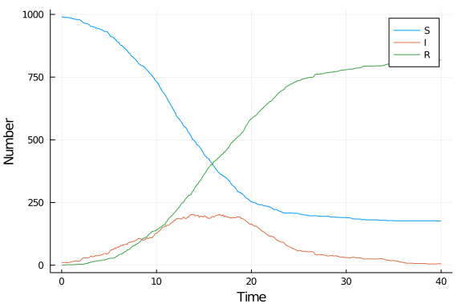

# Agent-based model using Agents.jl
Simon Frost (@sdwfrost), 2020-04-27

## Introduction

The agent-based model approach, implemented using [`Agents.jl`](https://github.com/JuliaDynamics/Agents.jl) taken here is:

- Stochastic
- Discrete in time
- Discrete in state

## Libraries

```julia
using Agents
using Random
using DataFrames
using Distributions
using DrWatson
using StatsPlots
using BenchmarkTools
```


## Utility functions

```julia
function rate_to_proportion(r::Float64,t::Float64)
    1-exp(-r*t)
end;
```


## Transitions

First, we have to define our agent, which has an `id`, and a `status` (`:S`,`:I`, or `:R`).

```julia
mutable struct Person <: AbstractAgent
    id::Int64
    status::Symbol
end
```


This utility function sets up the model, by setting parameter fields and adding agents to the model.

```julia
function init_model(β::Float64,c::Float64,γ::Float64,N::Int64,I0::Int64)
    properties = @dict(β,c,γ)
    model = ABM(Person; properties=properties)
    for i in 1:N
        if i <= I0
            s = :I
        else
            s = :S
        end
        p = Person(i,s)
        p = add_agent!(p,model)
    end
    return model
end;
```


The following function applies a series of functions to each agent.

```julia
function agent_step!(agent, model)
    transmit!(agent, model)
    recover!(agent, model)
end;
```


This is the transmission function; note that it operates on susceptibles making contact, rather than being focused on infected. This is an inefficient way of doing things, but shows the parallels between the different implementations.

```julia
function transmit!(agent, model)
    # If I'm not susceptible, I return
    agent.status != :S && return
    ncontacts = rand(Poisson(model.properties[:c]))
    for i in 1:ncontacts
        # Choose random individual
        alter = random_agent(model)
        if alter.status == :I && (rand() ≤ model.properties[:β])
            # An infection occurs
            agent.status = :I
            break
        end
    end
end;
```


This is the recovery function.

```julia
function recover!(agent, model)
    agent.status != :I && return
    if rand() ≤ model.properties[:γ]
            agent.status = :R
    end
end;
```


We need some reporting functions.

```julia
susceptible(x) = count(i == :S for i in x)
infected(x) = count(i == :I for i in x)
recovered(x) = count(i == :R for i in x);
```


## Time domain

```julia
δt = 0.1
nsteps = 400
tf = nsteps*δt
t = 0:δt:tf;
```


## Parameter values

```julia
β = 0.05
c = 10.0*δt
γ = rate_to_proportion(0.25,δt);
```


## Initial conditions

```julia
N = 1000
I0 = 10;
```


## Random number seed

```julia
Random.seed!(1234);
```


## Running the model

```julia
abm_model = init_model(β,c,γ,N,I0)
```

```
AgentBasedModel with 1000 agents of type Person
 no space
 scheduler: fastest
 properties: Dict(:γ => 0.024690087971667385,:c => 1.0,:β => 0.05)
```


```julia
to_collect = [(:status, f) for f in (susceptible, infected, recovered)]
abm_data, _ = run!(abm_model, agent_step!, nsteps; adata = to_collect);
```


## Post-processing

```julia
abm_data[!,:t] = t;
```


## Plotting

```julia
plot(t,abm_data[:,2],label="S",xlab="Time",ylabel="Number")
plot!(t,abm_data[:,3],label="I")
plot!(t,abm_data[:,4],label="R")
```




## Benchmarking

```julia
@benchmark begin
abm_model = init_model(β,c,γ,N,I0)
abm_data, _ = run!(abm_model, agent_step!, nsteps; adata = to_collect)
end
```

```
BenchmarkTools.Trial: 
  memory estimate:  187.47 KiB
  allocs estimate:  2328
  --------------
  minimum time:     398.471 ms (0.00% GC)
  median time:      479.306 ms (0.00% GC)
  mean time:        478.326 ms (0.00% GC)
  maximum time:     581.843 ms (0.00% GC)
  --------------
  samples:          11
  evals/sample:     1
```


