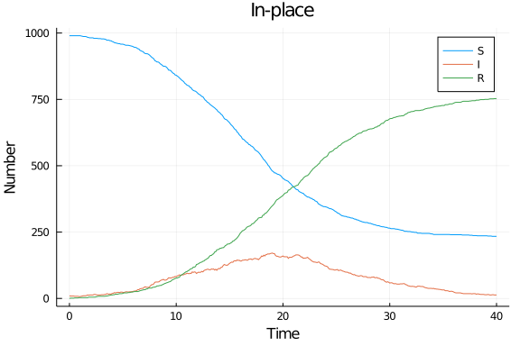

# Agent-based model using standard Julia
Simon Frost (@sdwfrost), 2020-05-03

## Introduction

The agent-based model approach is:

- Stochastic
- Discrete in time
- Discrete in state

There are multiple ways in which the model state can be updated. In this implementation, there is the initial state, `u`, and the next state, `u`, and updates occur by looping through all the agents (in this case, just a vector of states), and determining whether a transition occurs each state. This approach is relatively simple as there is a chain of states that an individual passes through (i.e. only one transition type per state). After all states have been updated in `du`, they are then assigned to the current state, `u`.

## Libraries

```julia
using Distributions
using StatsBase
using Random
using DataFrames
using StatsPlots
using BenchmarkTools;
```


## Utility functions

```julia
function rate_to_proportion(r::Float64,t::Float64)
    1-exp(-r*t)
end;
```


## Transitions

As this is a simple model, the global state of the system is a vector of infection states, defined using an `@enum`.

```julia
@enum InfectionStatus Susceptible Infected Recovered
```


This is an inefficient version that returns a new state vector.

```julia
function sir_abm(u,p,t)
    du = deepcopy(u)
    (β,c,γ,δt) = p
    N = length(u)
    for i in 1:N # loop through agents
        # If recovered
        if u[i]==Recovered continue
        # If susceptible
        elseif u[i]==Susceptible
            ncontacts = rand(Poisson(c*δt))
            du[i]=Susceptible
            ncontacts = rand(Poisson(c*δt))
            while ncontacts > 0
                j = sample(1:N)
                if j==i
                    continue
                end
                a = u[j]
                if a==Infected && rand() < β
                    du[i] = Infected
                    break
                end
                ncontacts -= 1
            end
        # If infected
    else u[i]==Infected
            if rand() < γ
                du[i] = Recovered
            end
        end
    end
    du
end;
```


This function is an in-place version.

```julia
function sir_abm!(du,u,p,t)
    (β,c,γ,δt) = p
    N = length(u)
    # Initialize du to u
    for i in 1:N
        du[i] = u[i]
    end
    for i in 1:N # loop through agents
        # If recovered
        if u[i]==Recovered
            continue
        # If susceptible
        elseif u[i]==Susceptible
            ncontacts = rand(Poisson(c*δt))
            while ncontacts > 0
                j = sample(1:N)
                if j==i
                    continue
                end
                a = u[j]
                if a==Infected && rand() < β
                    du[i] = Infected
                    break
                end
                ncontacts -= 1
            end
        # If infected
        else u[i]==Infected
            if rand() < γ
                du[i] = Recovered
            end
        end
    end
    nothing
end;
```


## Time domain

```julia
δt = 0.1
nsteps = 400
tf = nsteps*δt
tspan = (0.0,nsteps)
t = 0:δt:tf;
```


## Parameter values

```julia
β = 0.05
c = 10.0
γ = rate_to_proportion(0.25,δt)
p = [β,c,γ,δt];
```


## Initial conditions

```julia
N = 1000
I0 = 10
u0 = Array{InfectionStatus}(undef,N)
for i in 1:N
    if i <= I0
        s = Infected
    else
        s = Susceptible
    end
    u0[i] = s
end;
```


## Random number seed

```julia
Random.seed!(1234);
```


## Running the model

We need some reporting functions.

```julia
susceptible(x) = count(i == Susceptible for i in x)
infected(x) = count(i == Infected for i in x)
recovered(x) = count(i == Recovered for i in x);
```


This runs the version that generates new state vectors.

```julia
function sim(u0,nsteps,dt)
    u = copy(u0)
    t = 0.0
    ta = []
    Sa = []
    Ia = []
    Ra =[]
    push!(ta,t)
    push!(Sa,susceptible(u))
    push!(Ia,infected(u))
    push!(Ra,recovered(u))
    for i in 1:nsteps
        u=sir_abm(u,p,t)
        t = t + dt
        push!(ta,t)
        push!(Sa,susceptible(u))
        push!(Ia,infected(u))
        push!(Ra,recovered(u))
    end
    DataFrame(t=ta,S=Sa,I=Ia,R=Ra)
end;
```


Now, the in-place version.

```julia
function sim!(u0,nsteps,dt)
    u = copy(u0)
    du = copy(u0)
    t = 0.0
    ta = []
    Sa = []
    Ia = []
    Ra =[]
    push!(ta,t)
    push!(Sa,susceptible(u))
    push!(Ia,infected(u))
    push!(Ra,recovered(u))
    for i in 1:nsteps
        sir_abm!(du,u,p,t)
        u,du = du,u
        t = t + dt
        push!(ta,t)
        push!(Sa,susceptible(u))
        push!(Ia,infected(u))
        push!(Ra,recovered(u))
    end
    DataFrame(t=ta,S=Sa,I=Ia,R=Ra)
end;
```


```julia
df_abm = sim(u0,nsteps,δt);
```


```julia
df_abm! = sim!(u0,nsteps,δt);
```


## Plotting


```julia
@df df_abm plot(:t,
    [:S :I :R],
    label=["S" "I" "R"],
    xlabel="Time",
    ylabel="Number",
    title="New state")
```


```julia
@df df_abm! plot(:t,
    [:S :I :R],
    label=["S" "I" "R"],
    xlabel="Time",
    ylabel="Number",
    title="In-place")
```




## Benchmarking

```julia
@benchmark sim(u0,nsteps,δt)
```

```
BenchmarkTools.Trial: 
  memory estimate:  1.80 MiB
  allocs estimate:  2412
  --------------
  minimum time:     70.118 ms (0.00% GC)
  median time:      82.735 ms (0.00% GC)
  mean time:        84.600 ms (0.10% GC)
  maximum time:     113.642 ms (0.00% GC)
  --------------
  samples:          60
  evals/sample:     1
```


```julia
@benchmark sim!(u0,nsteps,δt)
```

```
BenchmarkTools.Trial: 
  memory estimate:  74.77 KiB
  allocs estimate:  1211
  --------------
  minimum time:     36.905 ms (0.00% GC)
  median time:      44.824 ms (0.00% GC)
  mean time:        45.322 ms (0.00% GC)
  maximum time:     65.667 ms (0.00% GC)
  --------------
  samples:          111
  evals/sample:     1
```


