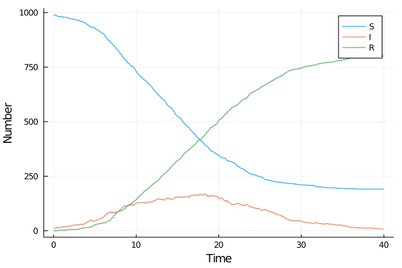

# Agent-based model using DifferentialEquations
Simon Frost (@sdwfrost), 2020-05-03

## Introduction

The agent-based model approach is:

- Stochastic
- Discrete in time
- Discrete in state

There are multiple ways in which the model state can be updated. In this implementation, there is the initial state, `u`, and the next state, `u`, and updates occur by looping through all the agents (in this case, just a vector of states), and determining whether a transition occurs each state. This approach is relatively simple as there is a chain of states that an individual passes through (i.e. only one transition type per state). After all states have been updated in `du`, they are then assigned to the current state, `u`.

## Libraries

```julia
using DifferentialEquations
using DiffEqCallbacks
using Distributions
using StatsBase
using Random
using DataFrames
using StatsPlots
using BenchmarkTools
```


## Utility functions

```julia
function rate_to_proportion(r::Float64,t::Float64)
    1-exp(-r*t)
end;
```


## Transitions

As this is a simple model, the global state of the system is a vector of infection states, defined using an `@enum`.

```julia
@enum InfectionStatus Susceptible Infected Recovered
```


The following is a fix to allow the model to be compiled, though we don't use any of the symbolic features of `DifferentialEquations.jl`.

```julia
Base.zero(::Type{InfectionStatus}) = Infected
```


```julia
function sir_abm!(du,u,p,t)
    (β,c,γ,δt) = p
    N = length(u)
    # Initialize du to u
    for i in 1:N
        du[i] = u[i]
    end
    for i in 1:N # loop through agents
        # If recovered
        if u[i]==Recovered
            continue
        # If susceptible
        elseif u[i]==Susceptible
            ncontacts = rand(Poisson(c*δt))
            while ncontacts > 0
                j = sample(1:N)
                if j==i
                    continue
                end
                a = u[j]
                if a==Infected && rand() < β
                    du[i] = Infected
                    break
                end
                ncontacts -= 1
            end
        # If infected
        else u[i]==Infected
            if rand() < γ
                du[i] = Recovered
            end
        end
    end
    nothing
end;
```


## Time domain

```julia
δt = 0.1
tf = 40.0
tspan = (0.0,tf);
```


## Parameter values

```julia
β = 0.05
c = 10.0
γ = rate_to_proportion(0.25,δt)
p = [β,c,γ,δt];
```


## Initial conditions

```julia
N = 1000
I0 = 10
u0 = Array{InfectionStatus}(undef,N)
for i in 1:N
    if i <= I0
        s = Infected
    else
        s = Susceptible
    end
    u0[i] = s
end
```


## Random number seed

```julia
Random.seed!(1234);
```


## Running the model

We need some reporting functions.

```julia
susceptible(u) = count(i == Susceptible for i in u)
infected(u) = count(i == Infected for i in u)
recovered(u) = count(i == Recovered for i in u);
```


```julia
saved_values = SavedValues(Float64, Tuple{Int64,Int64,Int64})
cb = SavingCallback((u,t,integrator)->(susceptible(u),infected(u),recovered(u)),
    saved_values,
    saveat=0:δt:tf);
```


```julia
prob_abm = DiscreteProblem(sir_abm!,u0,tspan,p);
```


```julia
sol_abm = solve(prob_abm,
    solver = FunctionMap(),
    dt = δt,
    callback = cb,
    dense = false,
    save_on = false);
```


## Post-processing

We can convert the output to a dataframe for convenience.

```julia
df_abm = DataFrame(saved_values.saveval)
rename!(df_abm,[:S,:I,:R])
df_abm[!,:t] = saved_values.t;
```


## Plotting

```julia
@df df_abm plot(:t,
    [:S :I :R],
    label=["S" "I" "R"],
    xlabel="Time",
    ylabel="Number")
```




## Benchmarking

```julia
@benchmark solve(prob_abm,
    solver=FunctionMap,
    dt=δt,
    callback=cb,
    dense=false,
    save_on=false)
```

```
BenchmarkTools.Trial: 
  memory estimate:  43.14 KiB
  allocs estimate:  66
  --------------
  minimum time:     59.735 ms (0.00% GC)
  median time:      79.393 ms (0.00% GC)
  mean time:        82.975 ms (0.00% GC)
  maximum time:     159.406 ms (0.00% GC)
  --------------
  samples:          61
  evals/sample:     1
```


