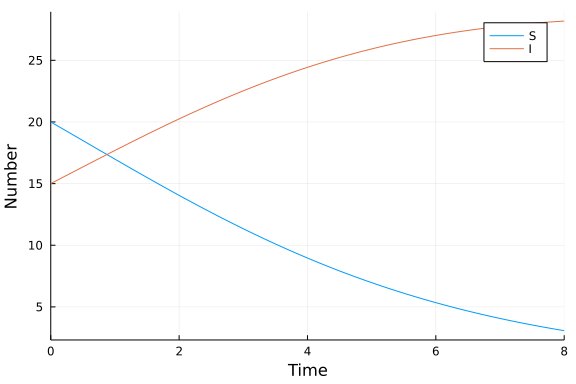
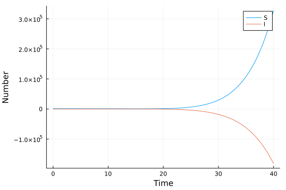
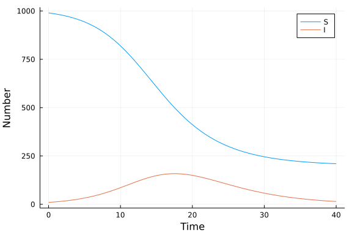

# Integral equation model using Adomian decomposition
Simon Frost (@sdwfrost), 2022-01-28

## Introduction

The classical ODE version of the SIR model is:

- Deterministic
- Continuous in time
- Continuous in state

We can rewrite the ODE model as a set of Volterra integral equations of the second kind, which can be solved by Adomian decomposition, in which the states of the system over time are approximated by polynomials in `t`. We consider a reduced system of `S(t)` and `I(t)` to keep things simple.

S(t) = S(0) -  ∫ βS(t)I(t) dt

I(t) = I(0) + ∫ βS(t)I(t) dt - ∫ γI(t) dt

Further details of this approach can be found in [Biazar (2006)](https://www.sciencedirect.com/science/article/abs/pii/S0096300305004145), and we initially use the parameter values and initial conditions used in this paper. While this approach is suboptimal for this simple system, the overall approach is straightforward to extend to more complex systems, including stochastic differential equations ([Adomian (1976)](https://www.researchgate.net/profile/Randolph-Rach/publication/216225028_Nonlinear_Stochastic_Differential_Equations/links/5e78655f4585157b9a546b00/Nonlinear-Stochastic-Differential-Equations.pdf)) and delay differential equations ([Adomian and Rach (1983)](https://www.sciencedirect.com/science/article/pii/0022247X8390094X), [Blanco-Cocom et al. (2012)](https://doi.org/10.1016/j.amc.2011.11.082)).

## Libraries

We load `DifferentialEquations` and `SimpleDiffEq` as a comparison with the polynomial approximation approach.

```julia
using DifferentialEquations
using SimpleDiffEq
using Polynomials
using ModelingToolkit
using Symbolics
using Plots
```


## Define Adomian polynomials

In the Adomian decomposition method, we approximate `S` and `I` by polynomials. We set the number of stages in the polynomial to truncate the approximation, `n`, the number of variables in the nonlinear function , `m` (`S` and `I`, so 2) and the nonlinear function, `f`.

```julia
M = 2
N = 10
f(s,i) = s*i;
```


To calculate the Adomian polynomials for the nonlinear `SI` term, we set up a `M` by `N` symbolic matrix, where the rows represent the variables `S` and `I` and the columns the terms in the polynomial.

```julia
@variables a[1:M,1:N];
```


We populate the matrix with the terms in the Adomian polynomials with the help of `Symbolics.derivative`. This uses a recursive approach described by Theorem 2 in [Duan (2011)](https://doi.org/10.1016/j.amc.2011.01.007).

```julia
An = [] # Empty array of Adomian
A₀ = f(a[1,1],a[2,1]) # s₀*i₀
push!(An,A₀)
for n = 1:(N-1)
  A = 0
  for i = 1:M
    for k = 1:n
      A += k*a[i,k+1]*Symbolics.derivative(An[end],a[i,k])
    end
  end
  A /= n
  push!(An,A)
end;
```


## Time domain

```julia
tspan = (0.0,8.0)
trange = 0:0.1:8;
```


## Initial conditions

```julia
u0 = [20.0 15.0]'; # S, I
```


## Parameter values

```julia
p = [0.01, 0.02]; # β, γ
```


## Building the model

We build the model one term at a time.

```julia
(S,I) = u0'
v = u0
β, γ = p'
Ii = integrate(Polynomial([I],:t))
F = eval(build_function(An[1],a))
SIi = integrate(Polynomial([F(v)],:t))
for i in 1:(N-1)
  vv = [Polynomial(ones(N),:t) Polynomial(ones(N),:t)]'
  vv[1,1] = -β*SIi
  vv[2,1] =  β*SIi - γ*Ii
  global v = hcat(v,vv)
  # Now update
  global I = v[2,i+1]
  global Ii = integrate(I)
  global F = eval(build_function(An[i+1],a))
  global SIi = integrate(F(v))
end
```


## Running the model

To run the model, we sum all the terms in the polynomial to generate approximations for `S(t)` and `I(t)`.

```julia
S = sum(v[1,1:end])
```

```
Polynomials.Polynomial(20.0 - 3.0*t - 0.045*t^2 + 0.028050000000000012*t^3 
+ 0.0007953750000000001*t^4 - 0.00031655025000000016*t^5 - 1.25312512500000
05e-5*t^6 + 3.5960149767857167e-6*t^7 + 1.846217766093751e-7*t^8 - 4.051290
3798281283e-8*t^9)
```


```julia
I = sum(v[2,1:end])
```

```
Polynomials.Polynomial(15.0 + 2.7*t + 0.017999999999999995*t^2 - 0.02817000
000000001*t^3 - 0.000654525*t^4 + 0.00031916835000000016*t^5 + 1.1467356750
000005e-5*t^6 - 3.628778853214288e-6*t^7 - 1.7554982947633938e-7*t^8 + 4.09
03014530450926e-8*t^9)
```


We can then evaluate these at specified timepoints.

```julia
Sa = [S(t) for t in trange]
Ia = [I(t) for t in trange];
```


```julia
plot(trange,Sa,label="S")
plot!(trange,Ia,label="I")
```


If we run the ODE version of the model, we see that the output is comparable.

```julia
function sir_ode!(du,u,p,t)
    (S,I) = u
    (β,γ) = p
    @inbounds begin
        du[1] = -β*S*I
        du[2] = β*S*I - γ*I
    end
    nothing
end
prob_ode = ODEProblem(sir_ode!,u0,tspan,p)
sol_ode = solve(prob_ode)
plot(sol_ode,
     label=["S" "I"],
     xlabel="Time",
     ylabel="Number")
```




## Breakdown of the approximation

If we use instead the initial conditions and parameter values used in other examples in this repository, the approximation breaks down. This is not surprising - the approximation is around the initial condition and the system is stiff. To demonstrate this problem, we rewrite the above code into a single function for ease of use. Firstly, we build functions to evaluate the Adomian polynomials.

```julia
Fv = [eval(build_function(An[i],a)) for i in 1:N];
```


```julia
function SIR(u0,p,trange,Fv)
  (S,I) = u0'
  v = u0
  β, γ = p'
  Ii = integrate(Polynomial([I],:t))
  SIi = integrate(Polynomial([Fv[1](v)],:t))
  for i in 1:(N-1)
    vv = [Polynomial(ones(N),:t) Polynomial(ones(N),:t)]'
    vv[1,1] = -β*SIi
    vv[2,1] =  β*SIi - γ*Ii
    v = hcat(v,vv)
    # Now update
    I = v[2,i+1]
    Ii = integrate(I)
    SIi = integrate(Fv[i+1](v))
  end
  S = sum(v[1,1:end])
  I = sum(v[2,1:end])
  Sa = [S(t) for t in trange]
  Ia = [I(t) for t in trange]
  return [trange Sa Ia]
end;
```


```julia
u0 = [990.0 10.0]'
p = [0.0005 0.25]
trange = 0:0.1:40
sol1 = SIR(u0,p,trange,Fv)
plot(sol1[1:end,1],sol1[1:end,2:3],
     label=["S" "I"],
     xlabel="Time",
     ylabel="Number")
```




One solution to this problem is to adopt a ['multistage' approach](https://doi.org/10.1016/j.amc.2003.08.049), in which we generate a series of polynomial approximations for windows of time.

```julia
u = u0
t = 0.0
sol = [[0.0 u']]
for i in 1:40
  s = SIR(u,p,0.0:0.1:1.0,Fv)
  s[1:end,1] .+= t
  global t += 1.0
  push!(sol,s[2:end,:])
  global u = s[end,2:3]
end
sol = vcat(sol...);
```


```julia
plot(sol[1:end,1],sol[1:end,2:3],
     label=["S" "I"],
     xlabel="Time",
     ylabel="Number")
```




This approximation now compares favourably with the ODE solver.

```julia
prob_ode2 = ODEProblem(sir_ode!,u0,(0,40.0),p)
sol_ode2 = solve(prob_ode2)
plot(sol_ode2,
     label=["S" "I"],
     xlabel="Time",
     ylabel="Number")
```


