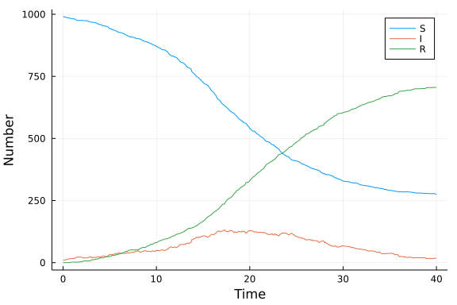
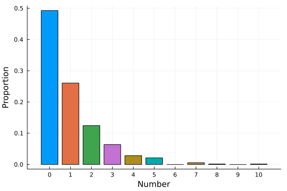

# SIR model tracking successful infective contacts
Sean L. Wu (@slwu89), 2021-11-30

## Introduction

This implements a standard continuous time Markov chain (jump process) SIR model, but uses 
[InfiniteArrays.jl](https://github.com/JuliaArrays/InfiniteArrays.jl) to track the cumulative
number of times any individual has successfully infected another. We note that for the standard
SIR model a finite sized array would be sufficient, but our
implementation should help provide an example for cases with an unbounded population size.

Tracking the number of infections caused by each infective is useful to demonstrate that even
in the well-mixed SIR model, the number of individuals causing $1, 2, 3, ...$ infections follows
a decreasing Geometric series (see [Distinguishing introductions from local transmission by Simon Frost](https://sdwfrost.github.io/mfo18/#/counting-infections) for details).

## Libraries

```julia
using InfiniteArrays
using Distributions
using DifferentialEquations
using Random
using Plots
```


## InfiniteArrays

We define two helper functions here to help deal with the infinite arrays. `find_end`
locates the index of the last nonzero element of an array, and `find_nonzero` locates
all indices containing nonzero elements.

The struct `SIR_struct` stores two infinite arrays. `I` is an array whose elements
are the number of persons who have infected the number of persons corresponding to the index minus one
(because the first element is the number of infective persons who haven't infected anyone yet). `R`
stores the cumulative number of persons in each bin. The struct is updated when a transition fires,
as seen below in the `affect!` functions.

```julia
# find index of last nonzero element
function find_end(I)
    findfirst(x -> isequal(x, sum(I)), cumsum(I))
end

# find indices of nonzero elements
function find_nonzero(I)
    last = find_end(I)
    findall(>(0), I[1:last])
end

struct SIR_struct
    I::AbstractArray
    R::AbstractArray
end

SIR_struct(I0) = SIR_struct(I0, zeros(Int64, ∞))
```


## Transitions

We use DifferentialEquations.jl to implement the stochastic simulation algorithm which samples jump
times. The rate functions are exactly the same as those in [Jump process (Gillespie) using DifferentialEquations.jl](https://github.com/epirecipes/sir-julia/blob/master/markdown/jump_process/jump_process.md). 


```julia
function infection_rate(u,p,t)
    (S,I,R) = u
    (β,c,γ) = p
    N = S+I+R
    β*c*I/N*S
end

function infection!(integrator, SIR::SIR_struct)

    I_elements = find_nonzero(SIR.I)
    infector_bin = wsample(I_elements, SIR.I[I_elements], 1)[1]

    # infector increases their count of infections by one
    SIR.I[infector_bin] -= 1
    SIR.I[infector_bin + 1] += 1

    # add a 0-infections infector
    SIR.I[1] += 1

    # update S and I
    integrator.u[1] -= 1
    integrator.u[2] = sum(SIR.I)

end

const infection_jump = ConstantRateJump(infection_rate, (integrator) -> infection!(integrator, SIR))
```


```julia
function recovery_rate(u,p,t)
    (S,I,R) = u
    (β,c,γ) = p
    γ*I
end

function recovery!(integrator, SIR::SIR_struct)

    I_elements = find_nonzero(SIR.I)
    recovery_bin = wsample(I_elements, SIR.I[I_elements], 1)[1]

    SIR.I[recovery_bin] -= 1
    SIR.R[recovery_bin] += 1

    integrator.u[2] = sum(SIR.I)
    integrator.u[3] = sum(SIR.R)
end

const recovery_jump = ConstantRateJump(recovery_rate, (integrator) -> recovery!(integrator, SIR))
```


## Time domain

```julia
tmax = 40.0
tspan = (0.0,tmax);
```


For plotting, we can also define a separate time series.

```julia
δt = 0.1
t = 0:δt:tmax;
```


## Initial conditions

```julia
u0 = [990,10,0]; # S,I,R

I0 = zeros(Int64, ∞)
I0[1] = u0[2]

SIR = SIR_struct(I0)
```


## Parameter values

```julia
p = [0.05,10.0,0.25]; # β,c,γ
```


## Random number seed

We set a random number seed for reproducibility.

```julia
Random.seed!(1234);
```


## Running the model

```julia
prob_discrete = DiscreteProblem(u0,tspan,p);
```


```julia
prob_jump = JumpProblem(prob_discrete,Direct(),infection_jump,recovery_jump);
```


```julia
sol_jump = solve(prob_jump,SSAStepper());
```


## Post-processing

In order to get output comparable across implementations, we output the model at a fixed set of times.

```julia
out_jump = sol_jump(t);
```


## Plotting

We can now plot the temporal trajectory.

```julia
plot(
    out_jump,
    label=["S" "I" "R"],
    xlabel="Time",
    ylabel="Number"
)
```




We also want to plot the distribution of bin sizes telling us how many infectives infected $1, 2, 3, ...$
persons over their infectious period.

```julia
infectors = find_nonzero(SIR.R)
infectors_counts = zeros(Int64, infectors[end])
infectors_counts[infectors] = SIR.R[infectors]

plot(
    infectors_counts, 
    seriestype = :bar, 
    xlabel="Number",
    ylabel="Frequency", 
    color = 1:length(infectors_counts), 
    legend = false,
    xticks = 1:length(infectors_counts),
    xformatter = x -> Int(x - 1)
)
```


