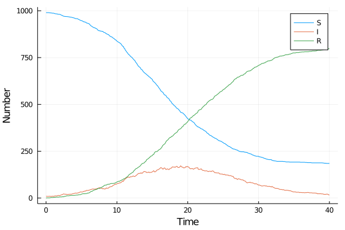

# Jump process using Catalyst.jl
Simon Frost (@sdwfrost), 2020-05-11, updated 2021-03-15

## Introduction

This implementation defines the model as a combination of two jump processes, infection and recovery, simulated using the [Doob-Gillespie algorithm](https://en.wikipedia.org/wiki/Gillespie_algorithm).

## Libraries

```julia
using Catalyst
using DiffEqJump
using Random
using DataFrames
using StatsPlots
using BenchmarkTools
```


## Transitions

```julia
sir_model = @reaction_network begin
  β*c/(s+i+r), s + i --> 2i
  γ, i --> r
end β c γ;
```


## Time domain

```julia
tmax = 40.0
tspan = (0.0,tmax);
```


For plotting, we also define a separate time series.

```julia
δt = 0.1
t = 0:δt:tmax;
```


## Initial conditions

```julia
u0 = [990,10,0]; # S,I,R
```


## Parameter values

```julia
p = [0.05,10.0,0.25];
```


## Random number seed

We set a random number seed for reproducibility.

```julia
Random.seed!(1234);
```


## Running the model

Running this model involves:

- Setting up the problem as a `DiscreteProblem`;
- Adding the jumps and setting the algorithm using `JumpProblem`; and
- Running the model, specifying `SSAStepper`.

```julia
prob_discrete = DiscreteProblem(sir_model,u0,tspan,p);
```


```julia
prob_jump = JumpProblem(sir_model,prob_discrete,Direct());
```


```julia
sol_jump = solve(prob_jump,SSAStepper());
```


## Post-processing

In order to get output comparable across implementations, we output the model at a fixed set of times.

```julia
out_jump = sol_jump(t);
```


We can convert to a dataframe for convenience.

```julia
df_jump = DataFrame(out_jump')
df_jump[!,:t] = out_jump.t;
```


## Plotting

We can now plot the results.

```julia
@df df_jump plot(:t,
    [:x1 :x2 :x3],
    label=["S" "I" "R"],
    xlabel="Time",
    ylabel="Number")
```




## Benchmarking

```julia
@benchmark solve(prob_jump,SSAStepper())
```

```
BenchmarkTools.Trial: 
  memory estimate:  3.72 KiB
  allocs estimate:  21
  --------------
  minimum time:     2.168 μs (0.00% GC)
  median time:      230.387 μs (0.00% GC)
  mean time:        274.216 μs (6.33% GC)
  maximum time:     10.458 ms (90.15% GC)
  --------------
  samples:          10000
  evals/sample:     1
```


