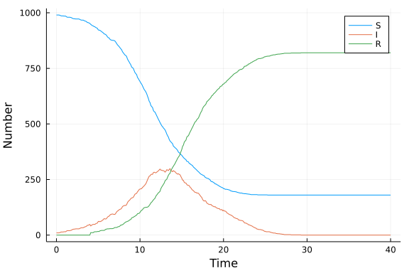

# Delayed stochastic jump process
Sean L. Wu (@slwu89), 2021-12-30

## Introduction

We demonstrate how to formulate stochastic models with delay. Here, the infection process
fires at the points of a Poisson process with the same rate as the standard continuous time stochastic
SIR model. However the recovery process occurs after a deterministic delay, given by the
points of the infection process plus $\tau$, the duration of the infectious period.

## Libraries

```julia
using DifferentialEquations
using Plots
using Random
using BenchmarkTools
```


## Transitions

The infection transition is defined normally, except that it adds a time to the
`tstops` field of the integrator $\tau$ units of time from now, when the newly infected person will recover.

```julia
function infection_rate(u,p,t)
    (S,I,R) = u
    (β,c,τ) = p
    N = S+I+R
    β*c*I/N*S
end

function infection!(integrator)
    (β,c,τ) = integrator.p
    integrator.u[1] -= 1
    integrator.u[2] += 1

    # queue recovery callback
    add_tstop!(integrator, integrator.t + τ)
end

infection_jump = ConstantRateJump(infection_rate,infection!);
```


## Callbacks

The recovery process is a callback that fires according to the queued
times in `tstops`. When it fires we need to delete that element of `tstops` and
decrement `tstops_idx`. The check in the `affect!` function is because DifferentialEquations.jl
also uses `tstops` to store the final time point in the time span of the solution, so
we only allow a person to be moved from the I to R compartment if there are persons in I.

We use `reset_aggregated_jumps!` because the callback modifies the rate of the
infection jump process, so it must be recalculated after the callback fires.

```julia
function recovery_condition(u,t,integrator)
    t == integrator.tstops[1]
end

function recovery!(integrator)
    if integrator.u[2] > 0
        integrator.u[2] -= 1
        integrator.u[3] += 1
    
        reset_aggregated_jumps!(integrator)
        popfirst!(integrator.tstops)
        integrator.tstops_idx -= 1
    end
end

recovery_callback = DiscreteCallback(recovery_condition, recovery!, save_positions = (false, false))
```


We must also code a callback that will fire when the initial 10 infectives recover. Because the infectious
period is deterministic, we use a `DiscreteCallback` that fires at time $\tau$.

```julia
function affect_initial_recovery!(integrator)
    integrator.u[2] -= u0[2]
    integrator.u[3] += u0[2]

    reset_aggregated_jumps!(integrator)
end

cb_initial_recovery = DiscreteCallback((u,t,integrator) -> t == p[3], affect_initial_recovery!)
```


## Time domain

```julia
tmax = 40.0
tspan = (0.0,tmax);
```


For plotting, we can also define a separate time series.

```julia
δt = 0.1
t = 0:δt:tmax;
```


## Initial conditions

```julia
u0 = [990,10,0]; # S,I,R
```


## Parameter values

To keep the simulations broadly comparable, the fixed infectious period `τ` is `1/γ` from the other tutorials.

```julia
p = [0.05,10.0,4.0]; # β,c,τ
```


## Random number seed

We set a random number seed for reproducibility.

```julia
Random.seed!(1234);
```


## Running the model

Running this model involves:

- Setting up the problem as a `DiscreteProblem`;
- Adding the jumps and setting the algorithm using `JumpProblem`; and
- Running the model, specifying `SSAStepper()`

```julia
prob = DiscreteProblem(u0,tspan,p);
```


```julia
prob_jump = JumpProblem(prob, Direct(), infection_jump);
```


```julia
sol_jump = solve(prob_jump, SSAStepper(), callback = CallbackSet(cb_initial_recovery, recovery_callback), tstops = [p[3]]);
```


## Post-processing

In order to get output comparable across implementations, we output the model at a fixed set of times.

```julia
out_jump = sol_jump(t);
```


## Plotting

We can now plot the results.

```julia
plot(
    out_jump,
    label=["S" "I" "R"],
    xlabel="Time",
    ylabel="Number"
)
```




## Benchmarking

```julia
@benchmark solve(prob_jump, SSAStepper(), callback = CallbackSet(cb_initial_recovery, recovery_callback), tstops = [p[3]]);
```

