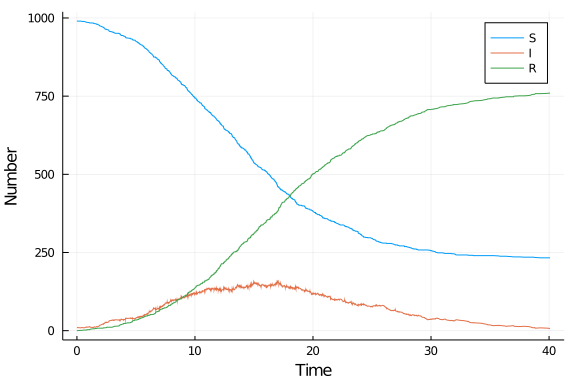

# Jump process using Gillespie.jl
Simon Frost (@sdwfrost), 2020-04-27

## Introduction

This implementation of a jump process uses [`Gillespie.jl`](https://github.com/sdwfrost/Gillespie.jl) rather than `DifferentialEquations.jl`.

## Libraries

We will need to install the (unregistered) package, `Gillespie.jl`

```julia
using Pkg
Pkg.add(PackageSpec(url="https://github.com/sdwfrost/Gillespie.jl", rev="master"))
```


The library can now be loaded along with the other packages.

```julia
using Gillespie
using Random
using StatsPlots
using BenchmarkTools
```


## Transitions

`Gillespie.jl` expects a single function that returns a vector of all the rates.

```julia
function sir_rates(x,parms)
  (S,I,R) = x
  (β,c,γ) = parms
  N = S+I+R
  infection = β*c*I/N*S
  recovery = γ*I
  [infection,recovery]
end;
```


The transitions are defined as an array of arrays.

```julia
sir_transitions = [[-1 1 0];[0 -1 1]];
```


This means that the first rate results in the first variable going down by one, and the second variable going up by one, with the third variable remaining unchanged, etc..


## Time domain

```julia
tmax = 40.0;
```


## Initial conditions

```julia
u0 = [990,10,0]; # S,I,R
```


## Parameter values

```julia
p = [0.05,10.0,0.25]; # β,c,γ
```


## Random number seed

We set a random number seed for reproducibility.

```julia
Random.seed!(1234);
```


## Running the model

```julia
sol_jump = ssa(u0,sir_rates,sir_transitions,p,tmax);
```


## Post-processing

`Gillespie.jl` has a convenience function to convert output to a `DataFrame`.

```julia
df_jump = ssa_data(sol_jump);
```


## Plotting

We can now plot the results.

```julia
@df df_jump plot(:time,
    [:x1 :x2 :x3],
    label=["S" "I" "R"],
    xlabel="Time",
    ylabel="Number")
```




## Benchmarking

```julia
@benchmark ssa(u0,sir_rates,sir_transitions,p,tmax)
```

```
BenchmarkTools.Trial: 
  memory estimate:  3.61 KiB
  allocs estimate:  33
  --------------
  minimum time:     5.874 μs (0.00% GC)
  median time:      390.527 μs (0.00% GC)
  mean time:        477.605 μs (13.80% GC)
  maximum time:     13.469 ms (91.93% GC)
  --------------
  samples:          10000
  evals/sample:     1
```


