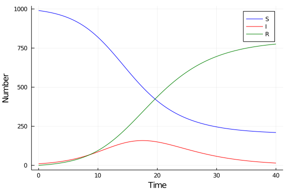
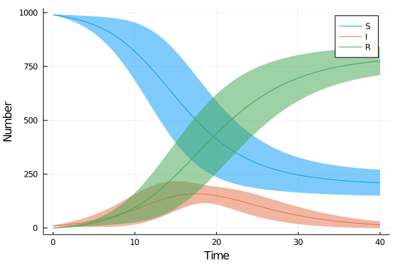

# Linear noise approximation
Simon Frost (@sdwfrost), 2020-06-11

## Introduction

A flexible way to specify models is in terms of the individual processes, in terms of their rates and the effect that these processes have on the states of the system. This approach, taken to write Gillespie-type jump processes, can be used to generate a linear noise approximation to the underlying stochastic system. See [Approximation  and  inference  methods  for stochastic  biochemical  kinetics - a  tutorial  review](https://arxiv.org/abs/1608.06582) and the code in [GpABC.jl](https://tanhevg.github.io/GpABC.jl/latest/overview-lna/) for further details.

The code here is adapted from the examples in `GpABC.jl` in order to be more consistent with the other tutorials in the repository, and to show the inner workings of the linear noise approximation.

## Libraries

```julia
using OrdinaryDiffEq
using ForwardDiff
using DataFrames
using LinearAlgebra
using StatsPlots
```


## Transitions

The following code expects a single function that returns a vector of all the rates.

```julia
function sir_rates(u,p)
  (S,I,R) = u
  (β,c,γ) = p
  N = S+I+R
  infection = β*c*I/N*S
  recovery = γ*I
  [infection,recovery]
end;
```


The transitions are defined as an array with the number of rows being the number of rates and the number of columns the number of states, the convention used in `Gillespie.jl`, with the exception that the states are continuous. This convention is also used [here](https://arxiv.org/abs/2001.05099).

```julia
sir_transitions = float.([[-1  1  0];
                          [ 0 -1  1]])
```

```
2×3 Array{Float64,2}:
 -1.0   1.0  0.0
  0.0  -1.0  1.0
```


This means that the first rate results in the first variable going down by one, and the second variable going up by one, with the third variable remaining unchanged, etc..

## Time domain

We set the timespan for simulations, `tspan`, initial conditions, `u0`, and parameter values, `p` (which are unpacked above as `[β,γ]`).

```julia
δt = 0.1
tmax = 40.0
tspan = (0.0,tmax)
t = 0.0:δt:tmax;
```


## Initial conditions

For the linear noise approximation, we need the initial conditions for the mean vector as well as the covariance matrix. The implementation below stacks a diaglonal matrix with the mean on top of the covariance matrix.

```julia
u0 = [990.0,10.0,0.0]; # S,I.R
c0 = zeros(3,3) # covariance matrix
uc0 = vcat(diagm(0=>u0), c0)
```

```
6×3 Array{Float64,2}:
 990.0   0.0  0.0
   0.0  10.0  0.0
   0.0   0.0  0.0
   0.0   0.0  0.0
   0.0   0.0  0.0
   0.0   0.0  0.0
```


## Parameter values

```julia
p = [0.05,10.0,0.25]; # β,c,γ
```


## Initialize functions

In order to make the following code more reusable, while keeping the code simple, we define the rate function and the transition stoichiometry matrix using more generic names.

```julia
rates = sir_rates
transitions = sir_transitions
nrates, nstates = size(transitions);
```


## Ordinary differential equation from rates and transitions

The rates and transitions can easily be used to define an ODE system.

```julia
function ode(du, u, p, t)
    du[1:3] = transitions' * rates(u, p)
end;
```


```julia
prob_ode = ODEProblem(ode, u0 ,tspan, p);
```


```julia
sol_ode = solve(prob_ode, Tsit5(), saveat=t);
```


```julia
df_ode = DataFrame(sol_ode(t)')
df_ode[!,:t] = t;
```


```julia
@df df_ode plot(:t,
    [:x1 :x2 :x3],
    label=["S" "I" "R"],
    xlabel="Time",
    ylabel="Number",
    c=[:blue :red :green])
```




## Linear noise approximation from rates and transitions

The rate and transition formulation also lends itself to deriving the linear noise approximation, which uses `ForwardDiff.jl` to calculate the required jacobian of the system.

The state `u` is two matrices concatenated on top of each other: a diagonal matrix with the means on the diagonal follwed by the covariance matrix; this implementation was developed in `GpABC.jl`.

```julia
function lna(du, u, p, t)
        mean_vec = diag(u)
        covar_mx = u[nstates+1:nstates*2,:]
        reaction_rates = rates(mean_vec, p)
        reaction_rates_jac = ForwardDiff.jacobian(
            y -> rates(y, p),
            mean_vec)
        A = transitions' * reaction_rates_jac
        du[1:nstates, :] .= diagm(0 => transitions'*reaction_rates)
        du[nstates + 1:end, :] .= A*covar_mx + covar_mx*A' + transitions' * diagm(0 => reaction_rates) * transitions
end;
```


## Running the model

```julia
prob_lna = ODEProblem(lna, uc0, tspan, p);
```


```julia
sol_lna = solve(prob_lna, Tsit5(),saveat=t);
```


## Post-processing

The following code extracts the mean and standard deviation of the trajectories.

```julia
mean_traj = Array{Float64,2}(undef, nstates, length(t))
covar_traj = Array{Array{Float64,2},1}(undef, length(t))
for j in 1:length(t)
    mean_traj[:,j] = diag(sol_lna[j][1:nstates,1:nstates])
    covar_traj[j] = sol_lna[j][nstates+1:end, 1:nstates]
end;
```


```julia
var_traj = zeros(nstates, length(t))
for (idx, elt) in enumerate(covar_traj)
    var_traj[:, idx] = diag(elt)
end
sd_traj = 1.96 .* sqrt.(var_traj);
```


## Plotting

```julia
plot(t, mean_traj',
     ribbon=sd_traj',
     label = ["S" "I" "R"],
     xlabel = "Time",
     ylabel = "Number")
```




Note that the implementation here does not lend itself well to either generating individual trajectories or to fitting data.

