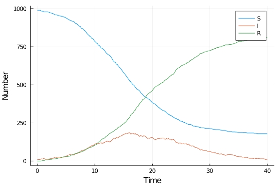

# Markov model
Simon Frost (@sdwfrost), 2020-04-27

## Introduction

The Markov model approach taken here is:

- Stochastic
- Discrete in time
- Discrete in state

## Libraries

```julia
using DifferentialEquations
using SimpleDiffEq
using Distributions
using Random
using DataFrames
using StatsPlots
using BenchmarkTools
```


## Utility functions

```julia
@inline function rate_to_proportion(r::Float64,t::Float64)
    1-exp(-r*t)
end;
```


## Transitions

```julia
function sir_markov!(du,u,p,t)
    (S,I,R) = u
    (β,c,γ,δt) = p
    N = S+I+R
    ifrac = rate_to_proportion(β*c*I/N,δt)
    rfrac = rate_to_proportion(γ,δt)
    infection=rand(Binomial(S,ifrac))
    recovery=rand(Binomial(I,rfrac))
    @inbounds begin
        du[1] = S-infection
        du[2] = I+infection-recovery
        du[3] = R+recovery
    end
    nothing
end;
```


## Time domain

Note that even though we're using fixed time steps, `DifferentialEquations.jl` complains if I pass integer timespans, so I set the timespan to be `Float64`.

```julia
δt = 0.1
nsteps = 400
tmax = nsteps*δt
tspan = (0.0,nsteps)
t = 0.0:δt:tmax;
```


## Initial conditions

```julia
u0 = [990,10,0]; # S,I,R
```


## Parameter values

```julia
p = [0.05,10.0,0.25,δt]; # β,c,γ,δt
```


## Random number seed

```julia
Random.seed!(1234);
```


## Running the model

```julia
prob_markov = DiscreteProblem(sir_markov!,u0,tspan,p)
```

```
DiscreteProblem with uType Array{Int64,1} and tType Float64. In-place: true
timespan: (0.0, 400.0)
u0: [990, 10, 0]
```


```julia
sol_markov = solve(prob_markov,solver=FunctionMap());
```


## Post-processing

We can convert the output to a dataframe for convenience.

```julia
df_markov = DataFrame(sol_markov')
df_markov[!,:t] = t;
```


## Plotting

We can now plot the results.

```julia
@df df_markov plot(:t,
    [:x1 :x2 :x3],
    label=["S" "I" "R"],
    xlabel="Time",
    ylabel="Number")
```




## Benchmarking

```julia
@benchmark solve(prob_markov,solver=FunctionMap)
```

```
BenchmarkTools.Trial: 
  memory estimate:  57.58 KiB
  allocs estimate:  448
  --------------
  minimum time:     69.481 μs (0.00% GC)
  median time:      106.547 μs (0.00% GC)
  mean time:        113.729 μs (3.05% GC)
  maximum time:     6.041 ms (95.72% GC)
  --------------
  samples:          10000
  evals/sample:     1
```


