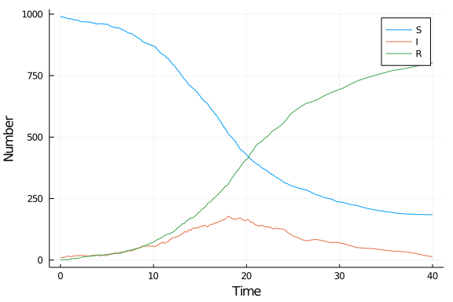

# Multivariate birth process reparameterisation of the SDE model
Simon Frost (@sdwfrost), 2020-06-12

## Introduction

[Fintzi et al.](https://arxiv.org/abs/2001.05099) reparameterise a stochastic epidemiological model in two ways:
- they consider the dynamics of time-integrated rates (infection and recovery in the SIR model); and
- they use a log-transformed scale, to model stochastic perturbations due to stochasticity on a multiplicative scale.

There are lots of advantages to this parameterisation, not the least that the states in this model more closely match the kind of data that are usually collected.

In the following, the dynamics of the cumulative numbers of infections, `C` and the number of recoveries, `R`, are explicitly modeled as `Ctilde=log(C+1)` and `Rtilde=log(R+1)`, with the dynamics of `S` and `I` determined using the initial conditions and the time-integrated rates. Although the code can be made more generic, for this tutorial, the code is kept to be specific for the SIR model for readability.

## Libraries

```julia
using DifferentialEquations
using StochasticDiffEq
using DiffEqCallbacks
using Random
using SparseArrays
using DataFrames
using StatsPlots
using BenchmarkTools
```


## Transitions

```julia
function sir_mbp!(du,u,p,t)
    (Ctilde,Rtilde) = u
    (β,c,γ,S₀,I₀,N) = p
    C = exp(Ctilde)-1.0
    R = exp(Rtilde)-1.0
    S = S₀-C
    I = I₀+C-R
    @inbounds begin
        du[1] = (exp(-Ctilde)-0.5*exp(-2.0*Ctilde))*(β*c*I/N*S)
        du[2] = (exp(-Rtilde)-0.5*exp(-2.0*Rtilde))*(γ*I)
    end
    nothing
end;
```


The pattern of noise for this parameterisation is a diagonal matrix.

```julia
# Define a sparse matrix by making a dense matrix and setting some values as not zero
A = zeros(2,2)
A[1,1] = 1
A[2,2] = 1
A = SparseArrays.sparse(A);
```


```julia
# Make `g` write the sparse matrix values
function sir_noise!(du,u,p,t)
    (Ctilde,Rtilde) = u
    (β,c,γ,S₀,I₀,N) = p
    C = exp(Ctilde)-1.0
    R = exp(Rtilde)-1.0
    S = S₀-C
    I = I₀+C-R
    du[1,1] = exp(-Ctilde)*sqrt(β*c*I/N*S)
    du[2,2] = exp(-Rtilde)*sqrt(γ*I)
end;
```


## Time domain

We set the timespan for simulations, `tspan`, initial conditions, `u0`, and parameter values, `p`, which contains both the rates of the model and the initial conditions of `S` and `I`.

```julia
δt = 0.1
tmax = 40.0
tspan = (0.0,tmax)
t = 0.0:δt:tmax;
```


## Initial conditions

```julia
u0 = [0.0,0.0]; # C,R
```


## Parameter values

```julia
p = [0.05,10.0,0.25,990.0,10.0,1000.0]; # β,c,γ,S₀,I₀,N
```


## Random number seed

```julia
Random.seed!(1234);
```


## Defining a callback

It is possible for the number of infected individuals to become negative. Here, a simple approach is taken where the integration is stopped if the number of infected individuals becomes negative. This is implemented using a `ContinuousCallback` from the `DiffEqCallbacks` library.

```julia
function condition(u,t,integrator,p) # Event when event_f(u,t) == 0
    (Ctilde,Rtilde) = u
    (β,c,γ,S₀,I₀,N) = p
    C = exp(Ctilde)-1.0
    R = exp(Rtilde)-1.0
    S = S₀-C
    I = I₀+C-R
    I
end;
```


```julia
function affect!(integrator)
    terminate!(integrator)
end;
```


```julia
cb = ContinuousCallback(
        (u,t,integrator)->condition(u,t,integrator,p),
        affect!);
```


## Running the model

```julia
prob_mbp = SDEProblem(sir_mbp!,sir_noise!,u0,tspan,p,noise_rate_prototype=A);
```


```julia
sol_mbp = solve(prob_mbp,
            SRA1(),
            callback=cb,
            saveat=δt);
```


## Post-processing

We can convert the output to a dataframe for convenience.

```julia
df_mbp = DataFrame(sol_mbp(sol_mbp.t)')
df_mbp[!,:C] = exp.(df_mbp[!,:x1]) .- 1.0
df_mbp[!,:R] = exp.(df_mbp[!,:x2]) .- 1.0
df_mbp[!,:S] = p[4] .- df_mbp[!,:C]
df_mbp[!,:I] = p[5] .+ df_mbp[!,:C] .- df_mbp[!,:R]
df_mbp[!,:t] = sol_mbp.t;
```


## Plotting

We can now plot the results.

```julia
@df df_mbp plot(:t,
    [:S :I :R],
    label=["S" "I" "R"],
    xlabel="Time",
    ylabel="Number")
```




## Benchmarking

```julia
@benchmark solve(prob_mbp,SRA1(),callback=cb)
```

```
Error: DomainError with -3308.979714852954:
sqrt will only return a complex result if called with a complex argument. T
ry sqrt(Complex(x)).
```


