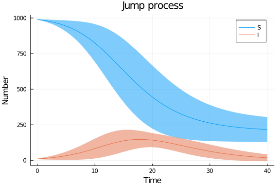
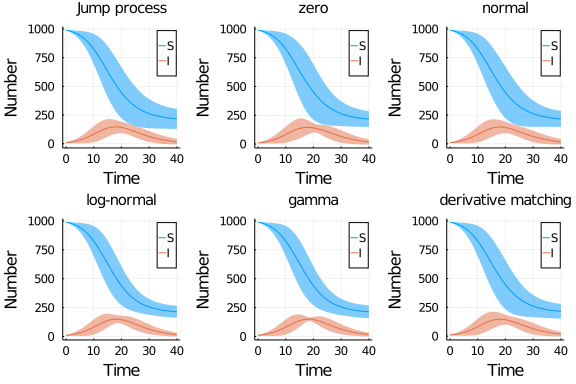

# Moment closure of an SIR reaction network model using MomentClosure.jl
Simon Frost (@sdwfrost), 2021-03-10

## Introduction

This tutorial demonstrates how we can take a stochastic process defined as a reaction network, and generate ordinary differential equations describing the mean, variances and covariances, and higher moments. For non-linear systems such as the SIR model, ODEs for one moment are in terms of higher moments. Hence, in order to limit the size of the system, it needs to be 'closed' i.e. an approximation is made for the higher moments. `MomentClosure.jl` has a number of strategies for doing this. In the following, I take a simplified (but equivalent) version of the SIR model considered in this repository and compare moment closure approximations with stochastic simulations.

## Libraries

```julia
using DifferentialEquations
using OrdinaryDiffEq
using MomentClosure
using ModelingToolkit
using DiffEqJump
using DataFrames
using Tables
using Statistics
using Plots
using StatsPlots
using Latexify
using BenchmarkTools
```


## Transitions

Some moment closure methods (e.g. log-normal) assume that the states of the system are positive. Hence, when describing the system, I omit recovered individuals, `R`. As the population size is constant, this does not affect the dynamics of `S` or `I`. In addition, I write the transmission rate as `βc` rather than `βc/N`; while this does not affect the dynamics of the populations (after changing the value of `β`), it makes generation of the moment equations more straightforward as the rate terms are polynomial.

I first define the parameters, variables, and reactions using ModelingToolkit.jl syntax.

```julia
@parameters t β c γ
@variables S(t) I(t);
```


```julia
rxs = [Reaction(β*c, [S,I], [I], [1,1], [2])
       Reaction(γ, [I], nothing)]
rs  = ReactionSystem(rxs, t, [S,I], [β,c,γ]);
```


## Time domain

We set the timespan for simulations.

```julia
δt = 0.1
tmax = 40.0
tspan = (0.0,tmax)
ts = 0:δt:tmax;
```


## Initial conditions

In `ModelingToolkit`, the initial values are defined by an vector of `Pair`s.

```julia
u0 = [S => 990.0, I => 10.0];
```


We will also need this as a vector of type `Real` for `MomentClosure.jl`.

```julia
u0v = [x[2] for x in u0];
```


## Parameter values

Similarly, the parameter values are defined by a dictionary.

```julia
p = [β=>0.00005, c=>10.0, γ=>0.25];
```


## Generating central moment equations

We often deal with central moments (mean, variances, etc.) in epidemiological models. For polynomial rates (e.g. λ=βSI), we only need to specify the order of the moments we would like to consider. For demonstration purposes, we'll set the order, `m` to be 4; even though we may just be interested in means and (co)variances, a higher order will give better approximations.

```julia
central_eqs = generate_central_moment_eqs(rs, 4, combinatoric_ratelaw=false);
```


## Moment closure

`MomentClosure.jl` provides many ways to close the system. For each system, we also need to generate a set of corresponding initial conditions. I'll take a selection of these methods.

```julia
closure_methods = ["zero","normal","log-normal","gamma","derivative matching"];
```


I generate a dictionary with the closed equations for each method.

```julia
closed_central_eqs = Dict(cm=>moment_closure(central_eqs,cm) for cm in closure_methods);
```


Next, I have to generate the corresponding initial condition, which is assumed to be determistic, for each method.

```julia
u0map = Dict(cm=> deterministic_IC(u0v,closed_central_eqs[cm]) for cm in closure_methods);
```


## Defining and solving the closed equations

The problem can now be defined and solved. Here, I cycle through the closure methods.

```julia
closed_central_eqs_df = Dict{String,DataFrame}()
for cm in closure_methods
    prob = ODEProblem(closed_central_eqs[cm], u0map[cm], tspan, p)
    sol = solve(prob)
    df = DataFrame(sol(ts)')
    rename!(df,[replace(string(x[1]),"(t)" => "") for x in u0map[cm]])
    df[!,:t] = ts
    closed_central_eqs_df[cm] = df
end;
```


## Compare with stochastic simulations

To evaluate the performance of the different moment closure methods, we take multiple stochastic simulations generated using Gillespie's SSA method, and compute the means and covariances.

```julia
jumpsys = convert(JumpSystem, rs)
u0i = [S => 990, I => 10]
dprob = DiscreteProblem(jumpsys, u0i, tspan, p)
jprob = JumpProblem(jumpsys, dprob, Direct());
```


```julia
ensemble_jprob = EnsembleProblem(jprob)
ensemble_jsol = solve(ensemble_jprob,SSAStepper(),trajectories=10000)
ensemble_summary = EnsembleSummary(ensemble_jsol,ts);
```


For plotting purposes, I extract the output into a `DataFrame`.

```julia
ensemble_u = DataFrame(ensemble_summary.u')
rename!(ensemble_u,["μ₁₀","μ₀₁"])
ensemble_v = DataFrame(ensemble_summary.v')
rename!(ensemble_v,["M₂₀","M₀₂"])
ensemble_uv = hcat(ensemble_u,ensemble_v)
ensemble_uv[!,:t] = ts;
```


To compare visually, I plot the mean ± 2 standard deviations for `S` and `I` based on the jump process samples.

```julia
jplot = @df ensemble_uv plot(:t,[:μ₁₀,:μ₀₁],
     ribbon=[2*sqrt.(:M₂₀),
             2*sqrt.(:M₀₂)],
     label=["S" "I"],
     xlabel="Time",
     ylabel="Number",
     title="Jump process")
```




I then cycle through the different moment closure methods and generate the corresponding plots.

```julia
pltlist = []
for cm in closure_methods
     plt = @df closed_central_eqs_df[cm] plot(:t,[:μ₁₀,:μ₀₁],
          ribbon=[2*sqrt.(:M₂₀),
                  2*sqrt.(:M₀₂)],
          label=["S" "I"],
          xlabel="Time",
          ylabel="Number",
          title=cm)
    push!(pltlist,plt)
end;
```


Plotting the different techniques out shows the broad agreement between the methods.

```julia
l = @layout [a b c; d e f]
plot(vcat(jplot,pltlist)...,
     layout=l,
     legendfontsize=8,
     titlefontsize=10)
```




I then calculate the L1 norm (i.e. the sum of the absolute differences) for the means and variances, and normalized by the number of timepoints (smaller=better).

```julia
m = []
c = []
v = []
for moment in [:μ₁₀,:μ₀₁,:M₂₀,:M₀₂]
    for cm in closure_methods
        push!(m,moment)
        push!(c,cm)
        push!(v,mean(abs.(closed_central_eqs_df[cm][!,moment] - ensemble_uv[!,moment])))
    end
end
df = DataFrame(Dict(["Moment" => m,"Method" => c,"Normalized L1" => v]))
table = latexify(df,latex=false,env=:mdtable)
table
```


|              Method | Moment |      Normalized L1 |
| -------------------:| ------:| ------------------:|
|                zero |    μ₁₀ |  2.076743811593393 |
|              normal |    μ₁₀ | 0.9660028576471896 |
|          log-normal |    μ₁₀ | 3.4172509695414037 |
|               gamma |    μ₁₀ |  3.773426587708943 |
| derivative matching |    μ₁₀ | 1.1222385637784211 |
|                zero |    μ₀₁ | 1.0900640143265146 |
|              normal |    μ₀₁ | 0.4506869337145166 |
|          log-normal |    μ₀₁ |  1.135808538529116 |
|               gamma |    μ₀₁ | 1.2360465592042413 |
| derivative matching |    μ₀₁ | 0.5219895074782513 |
|                zero |    M₂₀ |  859.5190426460044 |
|              normal |    M₂₀ |  294.8175805349172 |
|          log-normal |    M₂₀ |  2191.986285481674 |
|               gamma |    M₂₀ |  2119.538101919365 |
| derivative matching |    M₂₀ |  808.9884101999018 |
|                zero |    M₀₂ | 100.01733422072681 |
|              normal |    M₀₂ |  20.20663986521997 |
|          log-normal |    M₀₂ |  169.9840065328225 |
|               gamma |    M₀₂ |  206.7185371684887 |
| derivative matching |    M₀₂ |  44.68196394821103 |


For this particular example, the normal closure does the best in terms of describing the mean and variances.

## Benchmarks

Let's compare the speed of the simulations versus the moment closure system ("normal" method).

```julia
@benchmark solve(ensemble_jprob,SSAStepper(),trajectories=20000)
```

```
BenchmarkTools.Trial: 
  memory estimate:  3.91 GiB
  allocs estimate:  31131150
  --------------
  minimum time:     13.812 s (21.61% GC)
  median time:      13.812 s (21.61% GC)
  mean time:        13.812 s (21.61% GC)
  maximum time:     13.812 s (21.61% GC)
  --------------
  samples:          1
  evals/sample:     1
```


```julia
prob = ODEProblem(closed_central_eqs["normal"], u0map["normal"], tspan, p)
@benchmark sol = solve(prob)
```

```
BenchmarkTools.Trial: 
  memory estimate:  87.95 KiB
  allocs estimate:  540
  --------------
  minimum time:     182.615 μs (0.00% GC)
  median time:      268.745 μs (0.00% GC)
  mean time:        282.346 μs (0.00% GC)
  maximum time:     687.200 μs (0.00% GC)
  --------------
  samples:          10000
  evals/sample:     1
```


As can be seen above, if only the first few moments are of interest, the moment closure approach is much faster.
