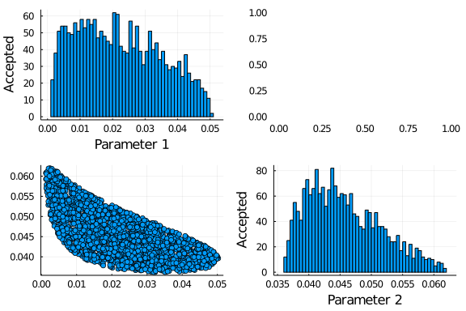
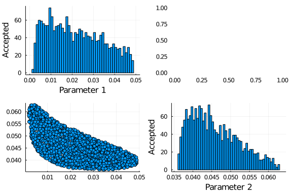
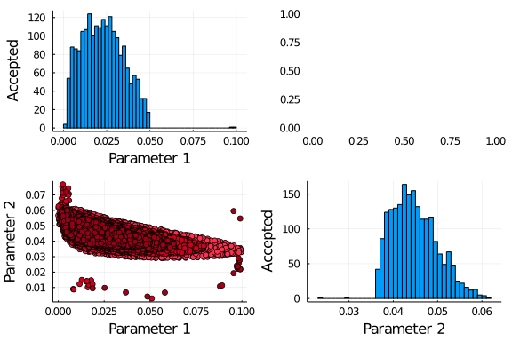
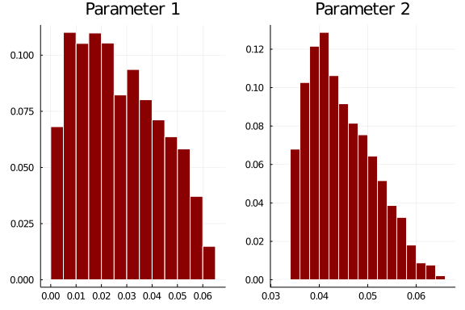

# Ordinary differential equation model with inference using ABC
Simon Frost (@sdwfrost), 2020-05-27

## Introduction

In this notebook, we try to infer the parameter values from a simulated dataset using Approximate Bayesian Computation (ABC).

## Libraries

```julia
using DifferentialEquations
using SimpleDiffEq
using Random
using Distributions
using GpABC
using Distances
using ApproxBayes
using Plots
```


## Model

A variable is included for the number of infections, $Y$.

```julia
function sir_ode!(du,u,p,t)
    (S,I,R,C) = u
    (β,c,γ) = p
    N = S+I+R
    infection = β*c*I/N*S
    recovery = γ*I
    @inbounds begin
        du[1] = -infection
        du[2] = infection - recovery
        du[3] = recovery
        du[4] = infection
    end
    nothing
end;
```


```julia
tmax = 40.0
δt = 1.0
tspan = (0.0,tmax)
obstimes = 1.0:δt:tmax;
u0 = [990.0,10.0,0.0,0.0]; # S,I.R,C
p = [0.05,10.0,0.25]; # β,c,γ
```


```julia
prob_ode = ODEProblem(sir_ode!,u0,tspan,p)
sol_ode = solve(prob_ode,saveat=δt)
out_ode = Array(sol_ode)
C = out_ode[4,:]
X = C[2:end] .- C[1:(end-1)];
```


```julia
Random.seed!(1234)
Y = rand.(Poisson.(X));
```


```julia
bar(obstimes,Y)
plot!(obstimes,X)
```


## GpABC

The `GpABC` package requires a function that takes parameter values (as an array) and returns data as an array with variables as rows and timepoints as columns.

In this example, two parameters will be estimated; the proportion of the population that are initially infected and the infection probability β.

```julia
function simdata(x)
    (i0,β) = x
    I = i0*1000.0
    prob = remake(prob_ode,u0=[1000-I,I,0.0,0.0],p=[β,10.0,0.25])
    sol = solve(prob,Tsit5(),saveat=δt)
    out = Array(sol)
    C = out[4,:]
    X = C[2:end] .- C[1:(end-1)]
    transpose(X)
end;
```


The priors are given as an array of `Distributions`. For this example, I'm using informative priors, which greatly speeds things up.

```julia
priors = [Uniform(0.0,0.1),Uniform(0.0,0.1)];
```


To compare the simulations with the real data, we convert the (integer) number of new cases to floating point, and reshape.

```julia
Yt = transpose(float.(Y));
```


### Simulation and rejection

A simple but brute force approach is to simulate multiple draws from the prior and accept those within a certain `threshold` distance. These are known as particles; in `GpABC`, this process continues until a given number of particles have been accepted. Here, the threshold is set at 80 (i.e. a distance of two per observation). This appears to run on all available cores by default.

```julia
n_particles = 2000
threshold = 80.0
sim_rej_result = SimulatedABCRejection(
    Yt, # data
    simdata, # simulator
    priors, # priors
    threshold, # threshold distance
    n_particles; # particles required
    max_iter=convert(Int, 1e7),
    distance_function = Distances.euclidean,
    write_progress=false);
```


```julia
plot(sim_rej_result)
```




### Emulation and rejection

The following code chunk runs emulation rather than simulation with rejection. Emulation is mostly advantageous with expensive models (unlike this one), but is included here for completeness.

```julia
n_design_points = 500
emu_rej_result = EmulatedABCRejection(Yt,
    simdata,
    priors,
    threshold,
    n_particles,
    n_design_points;
    max_iter=convert(Int, 1e7),
    distance_function = Distances.euclidean,
    write_progress=false);
```


```julia
plot(emu_rej_result)
```




### ABC-SMC

Running ABC with sequential Monte Carlo requires a sequence of thresholds. As the distance is floating point, this sequence also has to be floating point.

```julia
threshold_schedule = [110.0,100.0,90.0,80.0];
```


```julia
sim_smc_result = SimulatedABCSMC(Yt,
    simdata,
    priors,
    threshold_schedule,
    n_particles;
    max_iter=convert(Int, 1e7),
    distance_function = Distances.euclidean,
    write_progress=false);
```


```julia
population_colors=["#FF2F4E", "#D0001F", "#A20018", "#990017"]
plot(sim_smc_result, population_colors=population_colors)
```


### Emulation and SMC

When using emulation with SMC, it is possible to reuse simulations for retraining the emulator.

```julia
emu_smc_result = EmulatedABCSMC(Yt,
    simdata,
    priors,
    threshold_schedule,
    n_particles,
    n_design_points;
    distance_metric = Distances.euclidean,
    batch_size=1000,
    write_progress=false,
    emulator_retraining = PreviousPopulationThresholdRetraining(n_design_points, 100, 10),
    emulated_particle_selection = MeanVarEmulatedParticleSelection());
```


```julia
plot(emu_smc_result, population_colors=population_colors)
```




## ApproxBayes

The `ApproxBayes` library requires that the simulated data are in a different format than for `GpABC`. The distance function returns the distance *and* an additional result that can be used for e.g. returning the simulated data; here, a placeholder is returned.

```julia
function simdist(x, constants, y)
  s = transpose(simdata(x))
  Distances.euclidean(s, y), 1
end;
```


### Rejection

```julia
ab_rej_setup = ABCRejection(simdist, #simulation function
  2, # number of parameters
  threshold, #target ϵ
  Prior(priors); # Prior for each of the parameters
  maxiterations = 10^7, #Maximum number of iterations before the algorithm terminates
  nparticles = n_particles
  );
```


```julia
ab_rej = runabc(ab_rej_setup,
            Y,
            verbose = true,
            progress = true,
            parallel = true);
```

```
Preparing to run in parallel on 1 processors
```


```julia
plot(ab_rej)
```


### SMC

```julia
ab_smc_setup = ABCSMC(simdist, #simulation function
  2, # number of parameters
  threshold, #target ϵ
  Prior(priors), #Prior for each of the parameters
  maxiterations=convert(Int,1e7),
  nparticles=n_particles,
  α = 0.3,
  convergence = 0.05,
  kernel = uniformkernel
  );
```


```julia
ab_smc = runabc(ab_smc_setup,
            Y,
            verbose = true,
            progress = true,
            parallel = true);
```

```
##################################################
Use ABC rejection to get first population
Preparing to run in parallel on 1 processors
Running ABC SMC... 

Preparing to run in parallel on 1 processors
##################################################
Total number of simulations: 7.46e+03
Cumulative number of simulations = [2001, 7464]
Acceptance ratio: 2.68e-01
Tolerance schedule = [135.72, 89.93]

Median (95% intervals):
Parameter 1: 0.05 (0.00,0.10)
Parameter 2: 0.04 (0.02,0.06)
##################################################
```


```julia
plot(ab_smc)
```


