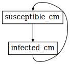
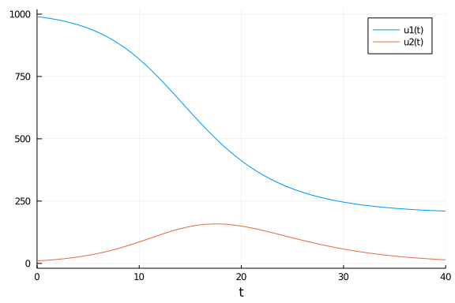
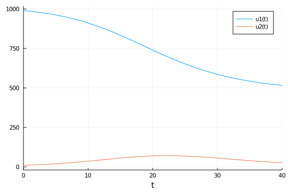
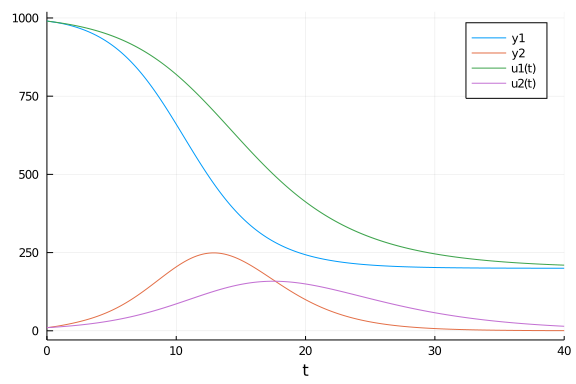
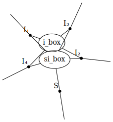
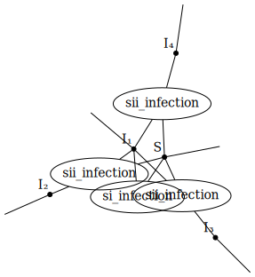
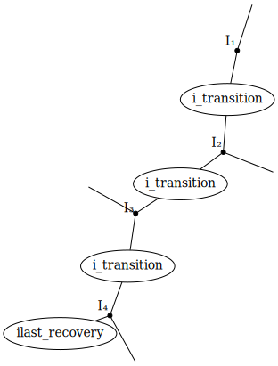

# Composing ODE models using AlgebraicDynamics.jl
Simon Frost (@sdwfrost) with contributions from Sophie Libkind (@slibkind), 2021-03-17

## Introduction

The [`AlgebraicDynamics.jl`](https://github.com/AlgebraicJulia/AlgebraicDynamics.jl) package allows composition of dynamical systems i.e. building up complex models from building blocks of simpler ones. Here, we look at different ways of building up these systems, and some simple extensions of the SIR model to include vital dynamics and to consider multiple sub-stages of infected individuals to allow non-exponential distributions for the infectious period.

To keep things simple, I only consider a reduced system with susceptibles and infected individuals, with a constant population size, and will onlu consider continuous time, deterministic (i.e. ODE) models.

## Libraries

```julia
using AlgebraicDynamics
using AlgebraicDynamics.UWDDynam
using AlgebraicDynamics.DWDDynam
using AlgebraicDynamics.CPortGraphDynam
using AlgebraicDynamics.CPortGraphDynam: barbell
using Catlab.WiringDiagrams
using Catlab.Programs # for @relation macro
using Catlab.Graphics # for to_graphviz
using OrdinaryDiffEq
using DataFrames
using Plots
using StatsPlots
```


## Time domain

As before, we define a time domain in order to simulate the final system.

```julia
δt = 0.1
tmax = 40
tspan = (0.0,tmax)
t = 0:δt:tmax;
```


## Initial conditions

As we only consider `S` and `I` individuals, we only have two initial conditions.

```julia
u0 = [990.0,10.0];
```


## Parameter values

The parameter values are simplified from other tutorials:

```julia
β, γ = 0.05*10/1000, 0.25; # in other tutorials, βc/N and γ
```


## Directed transitions

We can think of the SIR model as being composed of two sub-models, one for the susceptible population, `S`, and one for the infected population, `I`. When time is continuous, we define the rates at which each population changes (`u`) in response to other populations (`x`).

The rate at which susceptibles change is defined as follows, where `S=u[1]` and `I=x[1]`.

```julia
dots(u, x, p, t) = [-β*u[1]*x[1]]
```

```
dots (generic function with 1 method)
```


The rate at which infecteds changed is as follows, where `S=x[1]` and `I=u[1]`.

```julia
doti(u, x, p, t) = [β*x[1]*u[1] - γ*u[1]];
```


`AlgebraicDynamics.jl` calls the components of directed systems *machines*, which have the following components:

- Inputs (also called exogenous variables)
- States
- Outputs
- A dynamics function
- A readout function

We define a `ContinuousMachine` for susceptibles and infecteds, where we define the numerical type (`Float64`). Each has 1 input, 1 state, 1 output, a rate equation, and a readout function that is simply the observed state.

```julia
susceptible_cm = ContinuousMachine{Float64}(1,1,1, dots, u -> u)
infected_cm    = ContinuousMachine{Float64}(1,1,1, doti, u -> u);
```


We define the composition pattern incrementally, by first creating a `WiringDiagram`, adding boxes to the diagram using `add_box!`, and then adding wires between the boxes that determine the relationships.

```julia
directed_pattern = WiringDiagram([], [])
susceptible_box = add_box!(directed_pattern, Box(:susceptible_cm, [:pop], [:pop]))
infected_box = add_box!(directed_pattern, Box(:infected_cm, [:pop], [:pop]));
```


```julia
add_wires!(directed_pattern, Pair[
    (susceptible_box, 1) => (infected_box, 1),
    (infected_box, 1) => (susceptible_box, 1)
])
```


As a sanity check, we can display a Graphviz graph of the resulting wiring diagram.

```julia
to_graphviz(directed_pattern)
```




The susceptible machine is an input to the infected machine, and vice versa.

The system is composed using `oapply`, using the wiring diagram and the individual machines for S and I.

```julia
directed_system = oapply(directed_pattern, [susceptible_cm, infected_cm]);
```


Now we can convert to an `ODEProblem` and solve.

```julia
directed_prob = ODEProblem(directed_system, u0, tspan)
directed_sol = solve(directed_prob, FRK65(0));
```


```julia
plot(directed_sol)
```


### CPG

As an alternative to the above, we can create a circular port graph or CPG. A ready-made wiring diagram is `barbell`, which links one machine to another.

```julia
cpg_pattern = barbell(1)
```

```
CSet with elements Box = 1:2, Port = 1:2, Wire = 1:2, OuterPort = 1:0
┌──────┬─────┐
│ Port │ box │
├──────┼─────┤
│    1 │   1 │
│    2 │   2 │
└──────┴─────┘
┌──────┬─────┬─────┐
│ Wire │ src │ tgt │
├──────┼─────┼─────┤
│    1 │   1 │   2 │
│    2 │   2 │   1 │
└──────┴─────┴─────┘
```


The system is composed, converted into an ODEProblem, and solved as before.

```julia
cpg_system = oapply(cpg_pattern, [susceptible_cm, infected_cm]);
```


```julia
cpg_prob = ODEProblem(cpg_system, u0, tspan)
cpg_sol = solve(cpg_prob, FRK65(0));
```


```julia
plot(cpg_sol)
```




## Undirected transitions

For undirected transitions, we write equations for the rates of the systems in isolation from one another, then add the rates that couple the systems together. Note that the function signatures only have one state vector, `u`, passed to it rather than two (`u` and `x`).

The rate equation for transmission results has two components, as transmission reduces susceptibles and increases infecteds.

```julia
dotsi(u,p,t) = [-β*u[1]*u[2],β*u[1]*u[2]]
```

```
dotsi (generic function with 1 method)
```


The rate equation for recovery only has one component.

```julia
doti(u,p,t) = -γ*u;
```


In an undirected model, we have resource sharing - in this case, the processes of infection and recovery 'share' the number of susceptible individuals, `S`, and infected individuals, 'I'. We define a `ContinuousResourceSharer` using the type of the variable (in this case `Float64`), the number of resources shared by each process (2 for infection, 1 for recovery), and the function names that define the corresponding rates.

```julia
si_infection = ContinuousResourceSharer{Float64}(2, dotsi)
i_recovery = ContinuousResourceSharer{Float64}(1, doti);
```


```julia
undirected_pattern = @relation (S, I) begin
    si_infection(S,I)
    i_recovery(I)
end
```

```
ACSet with elements Box = 1:2, Port = 1:3, OuterPort = 1:2, Junction = 1:2
┌─────┬──────────────┐
│ Box │         name │
├─────┼──────────────┤
│   1 │ si_infection │
│   2 │   i_recovery │
└─────┴──────────────┘
┌──────┬─────┬──────────┐
│ Port │ box │ junction │
├──────┼─────┼──────────┤
│    1 │   1 │        1 │
│    2 │   1 │        2 │
│    3 │   2 │        2 │
└──────┴─────┴──────────┘
┌───────────┬────────────────┐
│ OuterPort │ outer_junction │
├───────────┼────────────────┤
│         1 │              1 │
│         2 │              2 │
└───────────┴────────────────┘
┌──────────┬──────────┐
│ Junction │ variable │
├──────────┼──────────┤
│        1 │        S │
│        2 │        I │
└──────────┴──────────┘
```


```julia
to_graphviz(undirected_pattern, box_labels = :name, junction_labels = :variable, edge_attrs=Dict(:len => ".75"))
```


```julia
undirected_system = oapply(undirected_pattern, [si_infection, i_recovery]);
```


```julia
undirected_prob = ODEProblem(undirected_system, u0, tspan)
undirected_sol = solve(undirected_prob,FRK65(0));
```


```julia
plot(undirected_sol)
```


## Adding vital dynamics

One extension to the simple SIR model is to go from a closed population to one with births (which replenish susceptibles) and deaths. To keep things simple, we keep the population constant, so we just need a single extra parameter for the per-capita death rate, μ, and define births as μ(S+I). As births and deaths balance for S, we just need a single extra equation for births from the infected subpopulation.

```julia
μ = 1.0/10
dotis(u,p,t) = [-μ*u[1],μ*u[1]];
```


```julia
is_birthdeath = ContinuousResourceSharer{Float64}(2, dotis);
```


```julia
undirected_open_pattern = @relation (S, I) begin
    si_infection(S,I)
    i_recovery(I)
    is_birthdeath(I,S)
end
```

```
ACSet with elements Box = 1:3, Port = 1:5, OuterPort = 1:2, Junction = 1:2
┌─────┬───────────────┐
│ Box │          name │
├─────┼───────────────┤
│   1 │  si_infection │
│   2 │    i_recovery │
│   3 │ is_birthdeath │
└─────┴───────────────┘
┌──────┬─────┬──────────┐
│ Port │ box │ junction │
├──────┼─────┼──────────┤
│    1 │   1 │        1 │
│    2 │   1 │        2 │
│    3 │   2 │        2 │
│    4 │   3 │        2 │
│    5 │   3 │        1 │
└──────┴─────┴──────────┘
┌───────────┬────────────────┐
│ OuterPort │ outer_junction │
├───────────┼────────────────┤
│         1 │              1 │
│         2 │              2 │
└───────────┴────────────────┘
┌──────────┬──────────┐
│ Junction │ variable │
├──────────┼──────────┤
│        1 │        S │
│        2 │        I │
└──────────┴──────────┘
```


```julia
to_graphviz(undirected_open_pattern, box_labels = :name, junction_labels = :variable, edge_attrs=Dict(:len => ".75"))
```


```julia
undirected_open_system = oapply(undirected_open_pattern, [si_infection, i_recovery, is_birthdeath]);
```


```julia
undirected_open_prob = ODEProblem(undirected_open_system, u0, tspan)
undirected_open_sol = solve(undirected_open_prob,FRK65(0));
```


```julia
plot(undirected_open_sol)
```




## Method of stages

Another extension to the simple SIR model is to add artificial stages in order to introduce non-exponential passage times, either in series, in parallel, or both. Let's choose 4 stages in serial for the infected subpopulation, which gives an Erlang distribution.

```julia
nstages = 4
δ = nstages*γ;
```


For convenience, we define functions that generate subscripted variables.

```julia
sub(i::Int) = i<0 ? error("$i is negative") : join('₀'+d for d in reverse(digits(i)))
sub(x::String,i::Int) = x*sub(i)
istages = [sub("I",i) for i=1:nstages]
```

```
4-element Array{String,1}:
 "I₁"
 "I₂"
 "I₃"
 "I₄"
```


We need to introduce three equations; for infection of susceptibles by I₂, I₃, and I₄, which gives rise to I₁; for transition between the infected subclasses, and for recovery of the last infected subclass, I₄.

```julia
dotsii(u,p,t) = [-β*u[1]*u[3],β*u[1]*u[3],0.0]
dotii(u,p,t) = [-δ*u[1],δ*u[1]]
dotilast(u,p,t) = [-δ*u[1]];
```


```julia
sii_infection = ContinuousResourceSharer{Float64}(3, dotsii)
i_transition = ContinuousResourceSharer{Float64}(2, dotii)
ilast_recovery = ContinuousResourceSharer{Float64}(1, dotilast);
```


```julia
undirected_pattern_stages = @relation (S, I₁, I₂, I₃, I₄) begin
    si_infection(S,I₁)
    sii_infection(S,I₁,I₂)
    sii_infection(S,I₁,I₃)
    sii_infection(S,I₁,I₄)
    i_transition(I₁,I₂)
    i_transition(I₂,I₃)
    i_transition(I₃,I₄)
    ilast_recovery(I₄)
end
```

```
ACSet with elements Box = 1:8, Port = 1:18, OuterPort = 1:5, Junction = 1:5
┌─────┬────────────────┐
│ Box │           name │
├─────┼────────────────┤
│   1 │   si_infection │
│   2 │  sii_infection │
│   3 │  sii_infection │
│   4 │  sii_infection │
│   5 │   i_transition │
│   6 │   i_transition │
│   7 │   i_transition │
│   8 │ ilast_recovery │
└─────┴────────────────┘
┌──────┬─────┬──────────┐
│ Port │ box │ junction │
├──────┼─────┼──────────┤
│    1 │   1 │        1 │
│    2 │   1 │        2 │
│    3 │   2 │        1 │
│    4 │   2 │        2 │
│    5 │   2 │        3 │
│    6 │   3 │        1 │
│    7 │   3 │        2 │
│    8 │   3 │        4 │
│    9 │   4 │        1 │
│   10 │   4 │        2 │
│   11 │   4 │        5 │
│   12 │   5 │        2 │
│   13 │   5 │        3 │
│   14 │   6 │        3 │
│   15 │   6 │        4 │
│   16 │   7 │        4 │
│   17 │   7 │        5 │
│   18 │   8 │        5 │
└──────┴─────┴──────────┘
┌───────────┬────────────────┐
│ OuterPort │ outer_junction │
├───────────┼────────────────┤
│         1 │              1 │
│         2 │              2 │
│         3 │              3 │
│         4 │              4 │
│         5 │              5 │
└───────────┴────────────────┘
┌──────────┬──────────┐
│ Junction │ variable │
├──────────┼──────────┤
│        1 │        S │
│        2 │       I₁ │
│        3 │       I₂ │
│        4 │       I₃ │
│        5 │       I₄ │
└──────────┴──────────┘
```


```julia
to_graphviz(undirected_pattern_stages, box_labels = :name, junction_labels = :variable, edge_attrs=Dict(:len => ".75"))
```


To generate the system from the stages, we can pass a vector of resource sharers in the same order as we defined in `undirected_pattern_stages`.

```julia
undirected_system_stages = oapply(undirected_pattern_stages, [
    si_infection
    sii_infection
    sii_infection
    sii_infection
    i_transition
    i_transition
    i_transition
    ilast_recovery])
```

```
ContinuousResourceSharer(ℝ^5 → ℝ^5) with 5 exposed ports
```


Alternatively, we can pass a dictionary keyed by the box name to specify which resource sharers plug into which box, where we don't have to worry about the order.

```julia
undirected_system_stages = oapply(undirected_pattern_stages, Dict(
    :si_infection  => si_infection,
    :sii_infection => sii_infection,
    :i_transition  => i_transition,
    :ilast_recovery => ilast_recovery
))
```

```
ContinuousResourceSharer(ℝ^5 → ℝ^5) with 5 exposed ports
```


We need to redefine the initial conditions to include the additional infected subclasses; we assume that all the initial infected individuals are in the first subclass, I₁.

```julia
u0stages = [990.0,10.0,0.0,0.0,0.0];
```


We can now define an `ODEProblem` and solve.

```julia
undirected_stages_prob = ODEProblem(undirected_system_stages, u0stages, tspan)
undirected_stages_sol = solve(undirected_stages_prob,FRK65(0));
```


To compare with the standard SIR, we process the output in order to calculate the total number of infected individuals, I₁+I₂+I₃+I₄.

```julia
undirected_stages_df = DataFrame(undirected_stages_sol(t)')
rename!(undirected_stages_df,["S";istages])
undirected_stages_df[!,:I] = undirected_stages_df[!,:I₁] +
                              undirected_stages_df[!,:I₂] +
                              undirected_stages_df[!,:I₃] +
                              undirected_stages_df[!,:I₄]
undirected_stages_df[:t] = t;
```


```julia
plot(undirected_stages_df[!,:t],
     [undirected_stages_df[!,:S],undirected_stages_df[!,:I]])
plot!(undirected_sol)
```




### Composition of patterns using ocompose

A more elegant way to specify the method of stages is to build out a composition pattern hierarchically. For example, we can start out with a pattern with two boxes:

1. A `si_box` that we will put all of the infection boxes inside.
2. A `i_box` that we will put all of the transition boxes inside.

```julia
undirected_si_pattern = @relation (S, I₁, I₂, I₃, I₄) begin
    si_box(S, I₁, I₂, I₃, I₄)
    i_box(I₁, I₂, I₃, I₄)
end;
```


```julia
to_graphviz(undirected_si_pattern, box_labels = :name, junction_labels = :variable, edge_attrs=Dict(:len => ".75"))
```




Then we can build patterns to put inside of these boxes:

```julia
si_pattern = @relation (S, I₁, I₂, I₃, I₄) begin
    si_infection(S,I₁)
    sii_infection(S,I₁,I₂)
    sii_infection(S,I₁,I₃)
    sii_infection(S,I₁,I₄)
end;
```


```julia
to_graphviz(si_pattern, box_labels = :name, junction_labels = :variable, edge_attrs=Dict(:len => ".75"))
```



```julia
i_pattern = @relation (I₁, I₂, I₃, I₄) begin
    i_transition(I₁,I₂)
    i_transition(I₂,I₃)
    i_transition(I₃,I₄)
    ilast_recovery(I₄)
end;
```


```julia
to_graphviz(i_pattern, box_labels = :name, junction_labels = :variable, edge_attrs=Dict(:len => ".75"))
```




And finally we put the patterns inside of the boxes using `ocompose`.

```julia
undirected_pattern_stages = ocompose(undirected_si_pattern, [si_pattern, i_pattern]);
```


```julia
to_graphviz(undirected_pattern_stages, box_labels = :name, junction_labels = :variable, edge_attrs=Dict(:len => ".75"))
```


