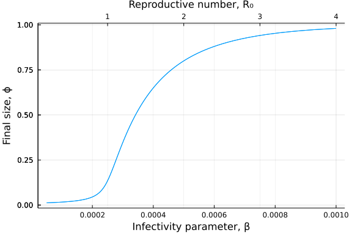
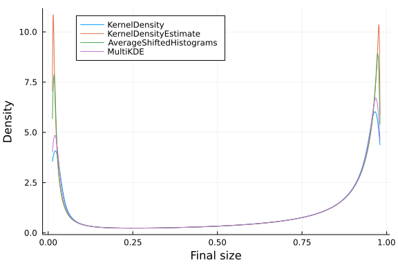
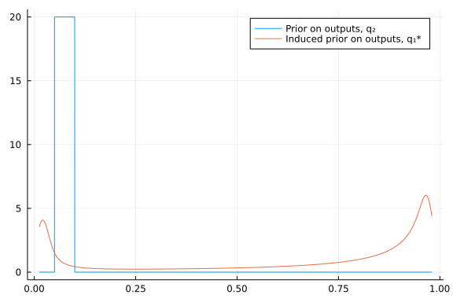
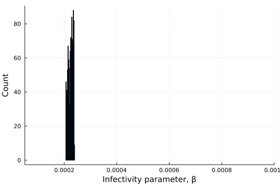
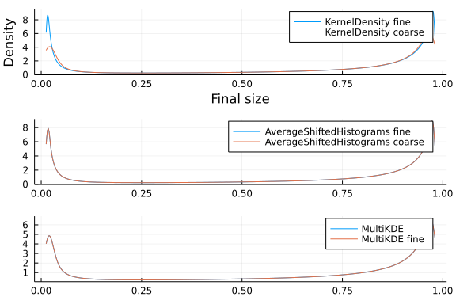

# Bayesian melding applied to ordinary differential equation model
Simon Frost (@sdwfrost), 2022-03-12

## Introduction

Bayesian melding is an approach to fit deterministic models, which takes into account uncertainty in both the inputs and the outputs. Following [Poole and Raftery (2000)](https://doi.org/10.1080/01621459.2000.10474324), we define a deterministic model M that maps a set of input parameters θ to a set of outputs ϕ. ψ denotes a set of *quantities of interest* (QoI) that may model inputs, model outputs, or functions of either or both. q₁(θ) is the prior distribution of inputs, q₂(ϕ) is the prior distribution of outputs, L₁(θ)=p(D₁|θ) is the likelihood of the inputs and L₂(ϕ)=p(D₂|ϕ) is the likelihood of the outputs, where D₁ and D₂ represent data. The inputs q₁(θ) and the model M induce a distribution on the outputs, denoted q₁⋆(ϕ). Bayesian synthesis uses logarithmic pooling to combine the information from the model, q₁⋆(ϕ), and the existing prior on the outputs, q₂(ϕ).

A sampling-importance-resampling approach to Bayesian melding proceeds as follows.

1. Draw k samples of θ from q₁(θ) to produce (θ₁,...,θₖ).
2. Run the model for each value of θ to give ϕᵢ=M(θᵢ).
3. Estimate the induced prior q₁⋆(ϕ) by applying density estimation techniques to ϕᵢ.
4. Calculate the importance sampling weights, wᵢ given by (q₂(ϕᵢ)/q₁⋆(ϕᵢ))¹⁻ᵅ × L₁(θᵢ) × L₂(ϕᵢ), where α is the pooling weight. α=0.5 gives equal weights to the induced prior q₁⋆ and the prior q₂.
5. Sample θᵢ with probability wᵢ to generate n samples.

This example takes an SIR ODE model and uses Bayesian melding using the final size of the epidemic, with priors on both the infectivity parameter β and the final size.

## Libraries

```julia
using OrdinaryDiffEq
using DiffEqCallbacks
using Optim
using Random
using Distributions
using StatsBase
using Plots
using BenchmarkTools
```


## Transitions

The following function is a simplified SIR ODE model, in which we combine the infectivity parameter and the contact rate into a single parameter.

```julia
function sir_ode!(du,u,p,t)
    (S,I,R) = u
    (β,γ) = p
    N = S+I+R
    @inbounds begin
        du[1] = -β*S*I
        du[2] = β*S*I - γ*I
        du[3] = γ*I
    end
    nothing
end;
```


## Time domain

We set the timespan for simulations to be high, as we will be using a callback in order to stop the integration early when the system reaches a steady state.

```julia
tmax = 10000.0
tspan = (0.0,tmax);
```


## Callbacks

If we just wanted the final size, we could use a `SteadyStateProblem` with the `DynamicSS` solver. To get access to the entire solution, we can use a callback instead to stop the simulation when it reaches a steady state.

```julia
cb_ss = TerminateSteadyState();
```


## Initial conditions and parameter values

We first set fixed parameters, in this case, the total population size, `N`. In addition, in order to define an `ODEProblem`, we also need a default set of initial conditions, `u`, and parameter values, `p`.

```julia
N = 1000.0;
u0 = [990.0,10.0,0.0];
p = [0.0005,0.25]; # β,γ
```


## Running the model

```julia
prob_ode = ODEProblem(sir_ode!,u0,tspan,p);
```


```julia
sol_ode = solve(prob_ode,Tsit5())
plot(sol_ode(0:1:40.0),
     xlabel="Time",
     ylabel="Number",
     labels=["S" "I" "R"])
```


## Bayesian melding

### Step 1: sampling the prior parameter values, θ

We assume a uniform prior on β, and sample β across a fine grid.

```julia
lb = 0.00005
ub = 0.001
δ = 0.0000001;
```


```julia
θ = lb:δ:ub;
```


If we had different prior information on β, we could sample from a different distribution (e.g. using the `rand` functions from `Distributions.jl`) or generate an additional set of prior weights to use in step 4, below (e.g. using the `pdf` functions from `Distributions.jl`).

### Step 2: simulating the model

We define the model M(θ) to generate values of ϕ - in this case, the final size of the epidemic as a fraction of the whole population.

```julia
M = function(θ)
  p = prob_ode.p
  p[1] = θ
  prob = remake(prob_ode;p=p)
  sol = solve(prob, ROS34PW3(),callback=cb_ss)
  ϕ = sol[end][3]/N
  ϕ
end;
```


An approximation to the final size (for large population size, N) is given by the solution of the implicit equation ϕ=1-S(0)exp(-R₀ϕ).

```julia
using Roots
M_analytic = function(θ)
  _,γ = prob_ode.p
  β = θ
  R₀ = β*N/γ
  S0 = prob_ode.u0[1]/N
  f(ϕ) = 1-S0*exp(-R₀*ϕ)-ϕ
  ϕ = find_zero(f,(0.0,1.0))
  ϕ
end;
```


We will use this later for improved speed, as shown below.

```julia
@benchmark M(p[1])
```

```
BenchmarkTools.Trial: 10000 samples with 1 evaluation.
 Range (min … max):  181.834 μs …  58.401 ms  ┊ GC (min … max): 0.00% … 99.
57%
 Time  (median):     234.746 μs               ┊ GC (median):    0.00%
 Time  (mean ± σ):   247.322 μs ± 994.697 μs  ┊ GC (mean ± σ):  6.96% ±  1.
72%

               ▂▃▂▂▂            ▂▆█▆▃▂▂▁                         
  ▁▁▁▁▁▁▂▂▂▂▃▃▅██████▆▄▃▃▂▂▃▄▅▇▇████████▇▅▄▃▂▃▂▂▂▂▂▂▂▁▁▁▁▁▁▁▁▁▁ ▃
  182 μs           Histogram: frequency by time          287 μs <

 Memory estimate: 126.00 KiB, allocs estimate: 1358.
```


```julia
@benchmark M_analytic(p[1])
```

```
BenchmarkTools.Trial: 10000 samples with 10 evaluations.
 Range (min … max):  1.644 μs …  12.053 μs  ┊ GC (min … max): 0.00% … 0.00%
 Time  (median):     1.834 μs               ┊ GC (median):    0.00%
 Time  (mean ± σ):   1.959 μs ± 665.190 ns  ┊ GC (mean ± σ):  0.00% ± 0.00%

  ▄▆██▆▄▂▁                                                    ▂
  █████████▇▆▆▇▇▅▅▅▆▃▃▁▆▄▁▃▄▄▄▇▄▁▃▄▁▁▁▁▁▃▄▁▁▁▃▆▇▇█▇▇▇▇▇▆▅▆▇▆▅ █
  1.64 μs      Histogram: log(frequency) by time      5.35 μs <

 Memory estimate: 736 bytes, allocs estimate: 24.
```


We can now generate the outputs `ϕ` by applying the model `M` to the vector of inputs `θ` using Julia's `.` syntax.

```julia
ϕ = M.(θ);
```


In this model, the basic reproductive number is given by the expression R₀=βN/γ, which is more easily interpretable than an infectivity parameter β. We compute this and plot the final size against both R₀ and infectivity. Plots.jl does not provide a `twiny` command so [following this StackOverflow post](https://stackoverflow.com/questions/64176617/julia-two-x-axes-for-plot-of-same-data), we add a second x axis.

```julia
R₀ = θ*N/p[2];
```


```julia
function twiny(sp::Plots.Subplot)
    sp[:top_margin] = max(sp[:top_margin], 30Plots.px)
    plot!(sp.plt, inset = (sp[:subplot_index], bbox(0,0,1,1)))
    twinsp = sp.plt.subplots[end]
    twinsp[:xaxis][:mirror] = true
    twinsp[:background_color_inside] = RGBA{Float64}(0,0,0,0)
    Plots.link_axes!(sp[:yaxis], twinsp[:yaxis])
    twinsp
end
twiny(plt::Plots.Plot = current()) = twiny(plt[1]);
```


```julia
plot(θ, ϕ,
     xlabel="Infectivity parameter, β",
     ylabel="Final size, ϕ",
     legend=false)
pl = twiny()
plot!(pl, R₀, ϕ, xlabel = "Reproductive number, R₀", legend = false)
```




### Step 3: estimating the probability density of the outputs

There are multiple packages in Julia that perform nonparametric density estimation. Here, we obtain estimates of the probability density of the induced prior q₁* using four different packages.

```julia
using KernelDensity
k_kd = kde_lscv(ϕ;boundary=(0.0,1.0),kernel=Normal)
q1star_kd = [pdf(k_kd, ϕᵢ) for ϕᵢ in ϕ];
```


```julia
using KernelDensityEstimate
k_kde = KernelDensityEstimate.kde!(ϕ)
q1star_kde = evaluateDualTree(k_kde,ϕ);
```


```julia
using AverageShiftedHistograms
k_ash = ash(ϕ)
q1star_ash = [AverageShiftedHistograms.pdf(k_ash,ϕᵢ) for ϕᵢ in ϕ];
```


```julia
using MultiKDE
k_mkde = KDEUniv(ContinuousDim(), 0.01, ϕ, MultiKDE.gaussian)
q1star_mkde = [MultiKDE.pdf(k_mkde, ϕᵢ, keep_all=false) for ϕᵢ in ϕ];
```


```julia
plot(ϕ,q1star_kd,label="KernelDensity",xlabel="Final size",ylabel="Density")
plot!(ϕ,q1star_kde,label="KernelDensityEstimate")
plot!(ϕ,q1star_ash,label="AverageShiftedHistograms")
plot!(ϕ,q1star_mkde,label="MultiKDE",legend=:top)
```




### Step 4: generating importance weights

We choose geometric weighting (α=0.5) and a prior on the final size of between 5% and 10% of the population. In this simple example, we don't have any data, so the likelihoods are all proportional to 1.

```julia
α = 0.5
q₂ = Distributions.pdf.(Uniform(0.05,0.1),ϕ)
L₁(θᵢ) = 1.0
L₂(ϕᵢ) = 1.0;
```


For illustration purposes, we will choose one method of density estimation (from `KernelDensity`).

```julia
plot(ϕ,q₂,label="Prior on outputs, q₂")
plot!(ϕ,q1star_kd,label="Induced prior on outputs, q₁*")
```



```julia
w_kd = (q₂ ./ q1star_kd).^(1-α) .* L₁.(θ) .* L₂.(ϕ);
```


Alternatively, on a logarithmic scale.

```julia
lw_kd = (1-α) .* log.(q₂) .- (1-α) .* log.(q1star_kd) .+ log.(L₁.(θ)) .+ log.(L₂.(ϕ));
```


For the other density estimators (and omitting L₁ and L₂ for brevity):

```julia
w_kde = (q₂ ./ q1star_kde).^(1-α)
w_ash = (q₂ ./ q1star_ash).^(1-α)
w_mkde = (q₂ ./ q1star_mkde).^(1-α);
```


### Step 5: resampling

Sampling with weights can be done using `StatsBase.jl`.

```julia
Random.seed!(123)
n = 1000
πθ = StatsBase.sample(θ, Weights(w_kd),n,replace=true);
```


Here is the mean and standard deviation of the model inputs after considering a prior on final size.

```julia
mean(πθ),std(πθ)
```

```
(0.0002240617, 9.139519348626814e-6)
```


```julia
histogram(πθ,
          bins=25,
          legend=false,
          xlim=(lb,ub),
          xlabel="Infectivity parameter, β",
          ylabel="Count")
```




## Discussion

An important consideration in importance sampling approaches is the *effective sample size* rather than just the actual sample size, `l`, for the final step. Measures of ESS can be obtained from the weights vector, `w`; one common derivation uses the inverse of the sum of the squared normalized weights. From the below, the resampling results in an effective sample size three times lower than the actual sample size, `n`.

```julia
w_norm = w_kd ./ sum(w_kd)
ess = 1.0/sum(w_norm .^ 2)
```

```
309.6994473568921
```


Other more complex algorithms such as [Incremental Mixture Importance Sampling (IMIS)](https://dx.doi.org/10.1111%2Fj.1541-0420.2010.01399.x) or [Langevin Incrementatl Mixture Importance Sampling (LIMIS)](https://doi.org/10.1007/s11222-017-9747-5) may give better performance when weights are highly variable.

Another important issue is the choice of nonparametric density estimation method. Below, we use a much finer grid of inputs; to reduce computational time, the analytic approximation is used, with parallel computations through the `ThreadsX` package. We do not evaluate the `KernelDensityEstimate` package, as the bandwidth selection is slow for the increased sample size.

```julia
using ThreadsX
θ_fine = lb:1e-10:ub
# We use ThreadsX instead of ϕ_fine = M_analytic.(θ_fine)
ϕ_fine = ThreadsX.collect(M_analytic(θᵢ) for θᵢ in θ_fine)
k_kd_fine = kde_lscv(ϕ_fine;boundary=(0.0,1.0),kernel=Normal)
#k_kde_fine = KernelDensityEstimate.kde!(ϕ_fine)
k_ash_fine = ash(ϕ_fine)
k_mkde_fine = KDEUniv(ContinuousDim(), 0.01, ϕ_fine, MultiKDE.gaussian)
q1star_kd_fine = [pdf(k_kd_fine, ϕᵢ) for ϕᵢ in ϕ]
#q1star_kde_fine = evaluateDualTree(k_kde_fine,ϕ_fine)
q1star_ash_fine = [AverageShiftedHistograms.pdf(k_ash_fine,ϕᵢ) for ϕᵢ in ϕ]
q1star_mkde_fine = ThreadsX.collect(MultiKDE.pdf(k_mkde_fine, ϕᵢ, keep_all=false) for ϕᵢ in ϕ);
```


```julia
l = @layout [a; b; c]
pl1 = plot(ϕ,q1star_kd_fine,label="KernelDensity fine",xlabel="Final size",ylabel="Density")
plot!(pl1,ϕ,q1star_kd,label="KernelDensity coarse")
pl2=plot(ϕ,q1star_ash_fine,label="AverageShiftedHistograms fine")
plot!(pl2,ϕ,q1star_ash,label="AverageShiftedHistograms coarse")
pl3=plot(ϕ,q1star_mkde,label="MultiKDE")
plot!(pl3,ϕ,q1star_mkde_fine,label="MultiKDE fine")
plot(pl1, pl2, pl3, layout=l)
```


