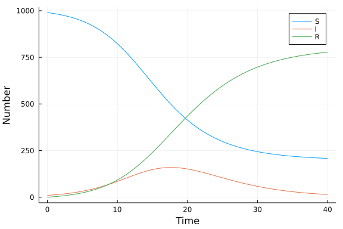

# Ordinary differential equation model using the Euler method
Simon Frost (@sdwfrost), 2022-05-05

## Introduction

The classical ODE version of the SIR model is:

- Deterministic
- Continuous in time
- Continuous in state

Perhaps the simplest approach to solve an ODE is [the Euler method](https://en.wikipedia.org/wiki/Euler_method), where the state `u` at some time `t+δ` in the future is `u+δ*u'`. While this is neither robust nor efficient, it is commonly used in the literature due to its ease of implementation.

## Libraries

```julia
using Tables
using DataFrames
using StatsPlots
using BenchmarkTools
```


## Transitions

The following function provides the derivatives of the model, which it changes in-place. State variables and parameters are unpacked from `u` and `p`; this incurs a slight performance hit, but makes the equations much easier to read.

```julia
function sir_ode!(du,u,p,t)
    (S,I,R) = u
    (β,c,γ) = p
    N = S+I+R
    @inbounds begin
        du[1] = -β*c*I/N*S
        du[2] = β*c*I/N*S - γ*I
        du[3] = γ*I
    end
    nothing
end;
```


## Model inputs

We set the time step, `δt`, the maximum time for simulations, `tmax`, initial conditions, `u0`, and parameter values, `p` (which are unpacked above as `[β,c,γ]`).

```julia
t0 = 0.0
δt = 0.1
tmax = 40.0
u0 = [990.0,10.0,0.0] # S,I,R
p = [0.05,10.0,0.25]; # β,c,γ
```


## Running the model

The following function takes an inplace function such as `sir_ode!` above, the initial conditions, the parameter values, the time step and the initial and maximum times. It returns the times at which the solution was generated, and the solution itself.

```julia
function euler(f, u0, p, δt, t0, tmax)
    t = t0 # Initialize time
    u = copy(u0) # Initialize struct parametric inherited
    du = zeros(length(u0)) # Initialize derivatives
    f(du,u,p,t)
    sol = [] # Store output
    times = [] # Store times
    push!(sol,copy(u))
    push!(times,t)
    # Main loop
    while t < tmax
        t = t + δt # Update time
        u .= u .+ du.*δt # Update state
        sir_ode!(du,u,p,t) # Update derivative
        push!(sol,copy(u)) # Store output
        push!(times,t) # Store time
    end
    sol = hcat(sol...) # Convert to matrix
    return times, sol
end;
```


```julia
times, sol = euler(sir_ode!, u0, p, δt, t0, tmax);
```


## Post-processing

We can convert the output to a dataframe for convenience.

```julia
df = DataFrame(Tables.table(sol'))
rename!(df,["S","I","R"])
df[!,:t] = times;
```


## Plotting

We can now plot the results.

```julia
@df df plot(:t,
    [:S :I :R],
    label=["S" "I" "R"],
    xlabel="Time",
    ylabel="Number")
```




## Benchmarking

```julia
@benchmark euler(sir_ode!, u0, p, δt, t0, tmax)
```

```
BenchmarkTools.Trial: 10000 samples with 1 evaluation.
 Range (min … max):  38.900 μs …   7.286 ms  ┊ GC (min … max): 0.00% … 98.6
6%
 Time  (median):     55.900 μs               ┊ GC (median):    0.00%
 Time  (mean ± σ):   66.660 μs ± 199.981 μs  ┊ GC (mean ± σ):  9.66% ±  3.2
6%

     ▂▇▂ ▅▂                ▆█▂                                  
  ▂▃▄███▇██▅▄▄▃▃▃▃▃▂▂▂▂▂▁▁▄███▆▅▄▃▄▃▂▂▂▂▂▃▂▂▂▂▂▂▁▁▁▁▁▁▁▁▁▁▁▁▁▁ ▃
  38.9 μs         Histogram: frequency by time          105 μs <

 Memory estimate: 86.39 KiB, allocs estimate: 828.
```


