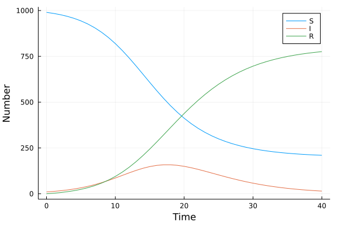
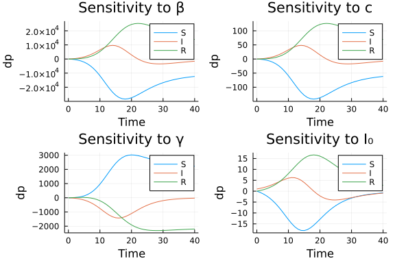

# Local sensitivity analysis applied to ordinary differential equation model using Zygote.jl
Simon Frost (@sdwfrost), 2022-03-02

## Introduction

This tutorial uses differentiation functions from `Zygote.jl` and functions from `DiffEqSensitivity.jl` package to explore local sensitivity of the output i.e. the gradient of the solution with respect to the parameters and initial conditions. This is useful if we have a set of 'best' parameters, but want to see how the solution changes as we perturb these parameters. Although this is only relevant close to a single solution, we do not have to specify e.g. ranges of parameters.

## Libraries

```julia
using OrdinaryDiffEq
using DiffEqSensitivity
using Zygote
using Plots
```


## Transitions

```julia
function sir_ode!(du,u,p,t)
    (S,I,R) = u
    (β,c,γ) = p
    N = S+I+R
    @inbounds begin
        du[1] = -β*c*I/N*S
        du[2] = β*c*I/N*S - γ*I
        du[3] = γ*I
    end
    nothing
end;
```


## Time domain

We set the timespan for simulations, `tspan`, initial conditions, `u0`, and parameter values, `p`.

```julia
δt = 1.0
tmax = 40.0
tspan = (0.0,tmax)
t = 0.0:δt:tmax
num_timepoints = length(t);
```


## Initial conditions


```julia
u0 = [990.0,10.0,0.0] # S,I,R
num_states = length(u0);
```


## Parameter values

```julia
p = [0.05,10.0,0.25]; # β,c,γ
num_params = length(p);
```


## Running the model

```julia
prob_ode = ODEProblem(sir_ode!,u0,tspan,p);
```


To enable calculation of the Jacobian for specific parameters/initial conditions, we first write a wrapper function.

```julia
sim_ode = (u0,p)-> solve(prob_ode,Tsit5(),u0=u0,p=p,saveat=t,sensealg=QuadratureAdjoint());
```


The solution can be obtained by calling this function.

```julia
sol_ode = sim_ode(u0,p);
```


To compute the gradient, we use `Zygote.jacobian`, passing the anove function that wraps `solve` and the input variables we want to compute the gradients for. The below will return the Jacobian for the initial conditions, `u0`, and for the parameter vector, `p`.

```julia
du0,dp = Zygote.jacobian(sim_ode,u0,p);
```


## Post-processing

The results are in the form of a stacked set of Jacobians for each timepoint (dimension `num_states*num_timepoints` by `num_params`). We can pull out the gradients for specific parameters and initial conditions using the following syntax.

```julia
dβ = reshape(dp[:,1],(num_states,:))' # as β is the first parameter
dc = reshape(dp[:,2],(num_states,:))' # c is 2nd parameter
dγ = reshape(dp[:,3],(num_states,:))' # γ is 3rd parameter
dI₀ = reshape(du0[:,2],(num_states,:))'; # I₀ is the 2nd initial condition
```


## Plotting

```julia
plot(sol_ode.t,
     Array(sol_ode(t))',
     labels = ["S" "I" "R"],
     xlabel = "Time",
     ylabel = "Number")
```



```julia
l = @layout [a b; c d]
pl1 = plot(t,dβ,xlabel="Time",ylabel="dp",label=["S" "I" "R"],title="Sensitivity to β")
pl2 = plot(t,dc,xlabel="Time",ylabel="dp",label=["S" "I" "R"],title="Sensitivity to c")
pl3 = plot(t,dγ,xlabel="Time",ylabel="dp",label=["S" "I" "R"],title="Sensitivity to γ")
pl4 = plot(t,dI₀,xlabel="Time",ylabel="dp",label=["S" "I"  "R"],title="Sensitivity to I₀")
plot(pl1,pl2,pl3,pl4,layout=l)
```




The above shows that (apart from scale), the sensitivity patterns are the same for `β` and `c` (not surprising as it is only their product that affects the solution), that differences in the initial number of infected individuals have a similar pattern to the infectivity parameters, and that the pattern of sensitivity to `γ` is approximately a mirror image of that of `β`.
