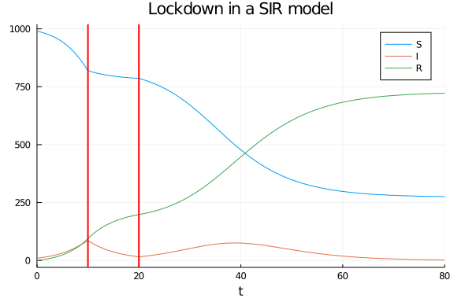

# Ordinary differential equation model with time varying β (lockdown)
Florian Oswald (@floswald), 2021-01-20

## Introduction

This is the classical ODE version of the SIR model with a temporary lockdown policy in place, using a `PresetTimeCallback`.

- Deterministic
- Continuous in time
- Continuous in state

## Libraries

```julia
using DifferentialEquations
using Plots
```


## Transitions

The following function provides the derivatives of the model, which it changes in-place. State variables and parameters are unpacked from `u` and `p`; this incurs a slight performance hit, but makes the equations much easier to read.

```julia
function sir_ode!(du,u,p,t)
    (S,I,R) = u
    (β,c,γ) = p
    N = S+I+R
    @inbounds begin
        du[1] = -β*c*I/N*S
        du[2] = β*c*I/N*S - γ*I
        du[3] = γ*I
    end
    nothing
end;
```


## Time domain

We set the timespan for simulations, `tspan`, initial conditions, `u0`, and parameter values, `p` (which are unpacked above as `[β,γ]`).

```julia
δt = 0.1
tmax = 80.0
tspan = (0.0,tmax)
t = 0.0:δt:tmax;
```


## Initial conditions

```julia
u0 = [990.0,10.0,0.0]; # S,I.R
```


## Parameter values

```julia
p = [0.05,10.0,0.25]; # β,c,γ
```


## Programming a Lockdown

Suppose we impose a lockdown which will reduce the transmission rate β to a lower value. For example's sake
suppose we reduce β to 0.01 starting in period 10 and up until period 20.

```julia
lockdown_times = [10.0, 20.0]
condition(u,t,integrator) = t ∈ lockdown_times
function affect!(integrator)
    if integrator.t < lockdown_times[2]
        integrator.p[1] = 0.01
    else
        integrator.p[1] = 0.05
    end
end
cb = PresetTimeCallback(lockdown_times, affect!);
```


## Running the model

```julia
prob_ode = ODEProblem(sir_ode!,u0,tspan,p)
```

```
ODEProblem with uType Array{Float64,1} and tType Float64. In-place: true
timespan: (0.0, 80.0)
u0: [990.0, 10.0, 0.0]
```


Call the solver with the specified callback function.

```julia
sol_ode = solve(prob_ode, callback = cb);
```


## Plotting

Let's use the `plot` recipe from the `DifferentialEquations` package:

```julia
plot(sol_ode, label = ["S" "I" "R"], title = "Lockdown in a SIR model")
vline!(lockdown_times, c = :red, w = 2, label = "")
```


