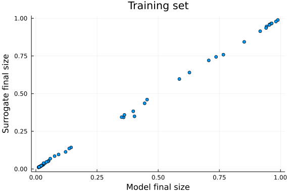
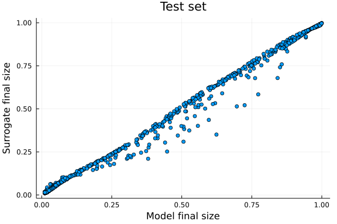
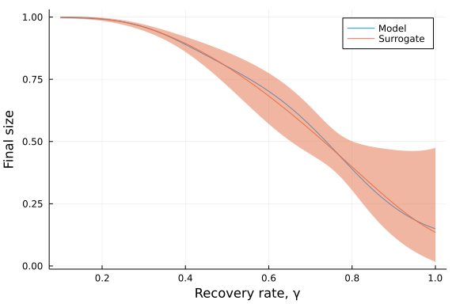
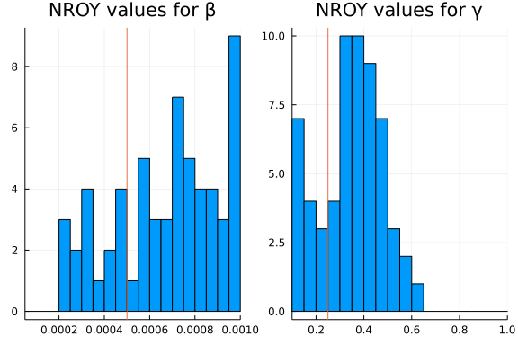

# Gaussian process surrogate model of an ordinary differential equation model
Simon Frost (@sdwfrost), 2022-03-17

## Introduction

This tutorial uses the Python package [mogp-emulator](https://github.com/alan-turing-institute/mogp-emulator) to train a Gaussian process emulator for the final size of an epidemic, with both the infectivity parameter, β, and the per-capita recovery rate, γ, allowed to vary.

## Libraries

```julia
using OrdinaryDiffEq
using DiffEqCallbacks
using Surrogates
using Conda
using PyCall
using Random
using Plots
using BenchmarkTools;
```


The following code (which only needs to be run once) installs the `mogp-emulator` package into a local Conda environment.

```julia
env = Conda.ROOTENV
Conda.pip_interop(true, env)
Conda.pip("install", "mogp-emulator");
```


We can now import the Python packages.

```julia
random = pyimport("random")
np = pyimport("numpy")
mogp = pyimport("mogp_emulator");
```


For reproducibility, we set the Julia random seed, the Python seed and the numpy random seed.

```julia
Random.seed!(123)
random.seed(123)
np.random.seed(123);
```


## Transitions

This is the standard ODE model widely used in this repository, with the exception that we collapse infectivity, the (constant) population size, N, and the contact rate into a single parameter, β.

```julia
function sir_ode!(du,u,p,t)
    (S,I,R) = u
    (β,γ) = p
    @inbounds begin
        du[1] = -β*S*I
        du[2] = β*S*I - γ*I
        du[3] = γ*I
    end
    nothing
end;
```


## Time domain

We set the maximum time to be high as we will stop the simulation via a callback.

```julia
tmax = 10000.0
tspan = (0.0,tmax)
δt = 1.0;
```


## Initial conditions

We need to run the model for lots of initial conditions and parameter values.

```julia
n_train = 50 # Number of training samples
n_test = 1000; # Number of test samples
```


We specify lower (`lb`) and upper (`ub`) bounds for each parameter.

```julia
# Parameters are β, γ
lb = [0.00005, 0.1]
ub = [0.001, 1.0];
```


## Setting up the model

Our simulation function will make use of a pre-defined `ODEProblem`, which we define here along with default parameter values.

```julia
N = 1000.0
u0 = [990.0,10.0,0.0]
p = [0.0005,0.25]
prob_ode = ODEProblem(sir_ode!,u0,tspan,p);
```


## Creating a surrogate model

We start by sampling values of β between the lower and upper bounds using Latin hypercube sampling (via Surrogates.jl), which will give more uniform coverage than a uniform sample given the low number of initial points.

```julia
sampler = LatinHypercubeSample();
```


```julia
θ = Surrogates.sample(n_train,lb,ub,sampler);
```


Gaussian processes do not restrict values to be positive; however, final size is bounded by 0 and 1. Hence, we consider a logit-transformed final size obtained by running the model until it reaches steady state.

```julia
logit = (x) -> log(x/(1-x))
invlogit = (x) -> exp(x)/(exp(x)+1.0)
cb_ss = TerminateSteadyState()
logit_final_size = function(z)
  prob = remake(prob_ode;p=z)
  sol = solve(prob, ROS34PW3(),callback=cb_ss)
  fsp = sol[end][3]/N
  logit(fsp)
end;
```


We can now calculate the logit final size as follows.

```julia
lfs = logit_final_size.(θ);
```


The following function call passes the array of input parameters, θ, and the array of logit-transformed final sizes, `lfs` to the `GaussianProcess` class in the Python `mogp-emulator` package, which assumes a single target variable.

```julia
gp = mogp.GaussianProcess(θ, lfs, nugget="fit");
```


Now that we have instantiated the Gaussian process, we can fit using maximum a posteriori (MAP) optimization. We will use multiple tries in order to get a good-fitting model. Many tries will generate errors.

```julia
gp = mogp.fit_GP_MAP(gp, n_tries=100);
```


The following automatically converts the output of the Python predict function to Julia.

```julia
lfs_train_pred = gp.predict(θ);
```


```julia
scatter(invlogit.(lfs),
        invlogit.(lfs_train_pred["mean"]),
        xlabel = "Model final size",
        ylabel = "Surrogate final size",
        legend = false,
        title = "Training set")
```




Now that we have fitted the Gaussian process, we can evaluate on a larger set of test parameters.

```julia
θ_test = sample(n_test,lb,ub,sampler)
lfs_test = logit_final_size.(θ_test)
lfs_test_pred = gp.predict(θ_test);
```


The output gives a reasonable approximation of the model output.

```julia
scatter(invlogit.(lfs_test),
        invlogit.(lfs_test_pred["mean"]),
        xlabel = "Model final size",
        ylabel = "Surrogate final size",
        legend = false,
        title = "Test set")
```




To gain further insights, we can fix one of the parameters while sweeping over a fine grid of the other. Firstly, we fix the recovery rate γ and vary β.

```julia
β_grid = collect(lb[1]:0.00001:ub[1])
θ_eval = [[βᵢ,0.25] for βᵢ in β_grid]
lfs_eval = gp.predict(θ_eval)
fs_eval = invlogit.(lfs_eval["mean"])
fs_eval_uc = invlogit.(lfs_eval["mean"] .+ 1.96 .* sqrt.(lfs_eval["unc"]))
fs_eval_lc = invlogit.(lfs_eval["mean"] .- 1.96 .* sqrt.(lfs_eval["unc"]))
plot(β_grid,
     fs_eval,
     xlabel = "Infectivity parameter, β",
     ylabel = "Final size",
     label = "Model")
plot!(β_grid,
      invlogit.(logit_final_size.(θ_eval)),
      ribbon = (fs_eval .- fs_eval_lc, fs_eval_uc - fs_eval),
      label = "Surrogate",
      legend = :right)
```


Note that in the above, for a range of values of β, the true value of the model lies outside of the uncertainty range of the emulator.

Now, we fix β and vary the recovery rate, γ.

```julia
γ_grid = collect(lb[2]:0.001:ub[2])
θ_eval = [[0.001,γᵢ] for γᵢ in γ_grid]
lfs_eval = gp.predict(θ_eval)
fs_eval = invlogit.(lfs_eval["mean"])
fs_eval_uc = invlogit.(lfs_eval["mean"] .+ 1.96 .* sqrt.(lfs_eval["unc"]))
fs_eval_lc = invlogit.(lfs_eval["mean"] .- 1.96 .* sqrt.(lfs_eval["unc"]))
plot(γ_grid,
     fs_eval,
     xlabel = "Recovery rate, γ",
     ylabel = "Final size",
     label = "Model")
plot!(γ_grid,
      invlogit.(logit_final_size.(θ_eval)),
      ribbon = (fs_eval .- fs_eval_lc, fs_eval_uc - fs_eval),
      label = "Surrogate")
```




## History matching

[History matching](https://mogp-emulator.readthedocs.io/en/latest/methods/thread/ThreadGenericHistoryMatching.html) is an approach used to learn about the inputs to a model using observations of the real system. The history matching process typically involves the use of expectations and variances of emulators, such as those generated by the Gaussian process emulator above. History matching seeks to identify regions of the input space that would give rise to acceptable matches between model output and observed data. 'Implausible' model outputs that are very different from the observed data are discarded, leaving a 'not ruled out yet' (NROY) set of input parameters.

Firstly, we need some observations. We'll take the final size at the default parameter values `p` as our observation.

```julia
obs = logit_final_size(p)
invlogit(obs)
```

```
0.8002018838621442
```


To generate a `HistoryMatching` object, we pass the fitted Gaussian process, the observation, the coordinates at which we want to evaluate the fit and a threshold of implausibility that will be used to rule out parameter sets.

```julia
hm = mogp.HistoryMatching(gp=gp,
                          obs=obs,
                          coords=np.array(θ_test),
                          threshold=3.0);
```


The `get_NROY` method returns the indices of the NROY points; Python uses zero indexing, so we need to add one in order to use them in Julia.

```julia
nroy_points = hm.get_NROY() .+ 1
length(nroy_points),n_test
```

```
(60, 1000)
```


The number of parameter sets that are plausible decreased by an order of magnitude when history matching was applied. The below shows that the true values of β and γ are in the NROY set.

```julia
x = [θᵢ[1] for θᵢ in θ_test]
y = [θᵢ[2] for θᵢ in θ_test]
l = @layout [a b]
pl1 = histogram(x[nroy_points],legend=false,xlim=(lb[1],ub[1]),bins=lb[1]:0.00005:ub[1],title="NROY values for β")
vline!(pl1,[p[1]])
pl2 = histogram(y[nroy_points],legend=false,xlim=(lb[2],ub[2]),bins=lb[2]:0.05:ub[2],title="NROY values for γ")
vline!(pl2,[p[2]])
plot(pl1, pl2, layout = l)
```




In practice, an iterative approach would be taken where the non-implausible parameter sets are used to generate a new set of parameter samples, from which a new emulator is fitted, and the new set of parameter values are filtered on the basis of the implausibility measure.

## Benchmarking

The following demonstrates that the Gaussian process actually takes more time than this (admittedly simple) model, although given the parameter-dependent running time (as we run until steady state), simple summary statistics aren't that informative. The emulator does take significantly less memory, and this may be an important consideration in some settings.

```julia
@benchmark logit_final_size(p)
```

```
BenchmarkTools.Trial: 10000 samples with 1 evaluation.
 Range (min … max):  176.086 μs … 60.175 ms  ┊ GC (min … max): 0.00% … 99.4
6%
 Time  (median):     237.081 μs              ┊ GC (median):    0.00%
 Time  (mean ± σ):   254.729 μs ±  1.033 ms  ┊ GC (mean ± σ):  7.01% ±  1.7
2%

                         █▁         ▁  ▁                        
  ▁▁▁▁▁▁▁▂▂▂▂▃▃▇▅▃▃▃▂▃▄▃▆██▆▅▅▅▆▆▅▅██████▆▅▅▄▃▂▂▂▂▂▂▁▁▁▁▁▁▁▁▁▁ ▃
  176 μs          Histogram: frequency by time          298 μs <

 Memory estimate: 125.92 KiB, allocs estimate: 1355.
```


```julia
@benchmark gp.predict(p)
```

```
BenchmarkTools.Trial: 10000 samples with 1 evaluation.
 Range (min … max):  254.729 μs …  18.757 ms  ┊ GC (min … max): 0.00% … 0.0
0%
 Time  (median):     277.294 μs               ┊ GC (median):    0.00%
 Time  (mean ± σ):   296.904 μs ± 261.905 μs  ┊ GC (mean ± σ):  0.00% ± 0.0
0%

   ▃▅▆▇█▇▆▅▄▄▄▃▄▃▃▃▂▃▂▁▂▁▂▁▁▁                                   ▂
  ████████████████████████████████▇▇▇▇▆▆▇▆▇▆▆▆▆▆▆▇▆▆▆▅▆▆▆▅▅▅▅▅▂ █
  255 μs        Histogram: log(frequency) by time        477 μs <

 Memory estimate: 9.70 KiB, allocs estimate: 188.
```


