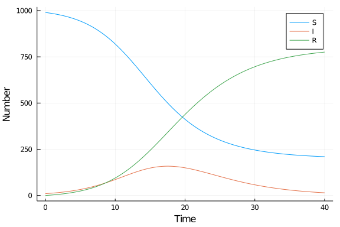

# Ordinary differential equation model using ModelingToolkit
Simon Frost (@sdwfrost), 2020-05-04

## Introduction

The classical ODE version of the SIR model is:

- Deterministic
- Continuous in time
- Continuous in state

This version, unlike the 'vanilla' ODE version, uses [ModelingToolkit](https://mtk.sciml.ai/). For small problems such as this, it doesn't make much of a difference for compute time, but it is a little more expressive and lends itself to extending a little better.

## Libraries

```julia
using DifferentialEquations
using ModelingToolkit
using OrdinaryDiffEq
using DataFrames
using StatsPlots
using BenchmarkTools
```


## Transitions

```julia
@parameters t β c γ
@variables S(t) I(t) R(t)
@derivatives D'~t
N=S+I+R # This is recognized as a derived variable
eqs = [D(S) ~ -β*c*I/N*S,
       D(I) ~ β*c*I/N*S-γ*I,
       D(R) ~ γ*I];
```


```julia
sys = ODESystem(eqs);
```


## Time domain

We set the timespan for simulations, `tspan`, initial conditions, `u0`, and parameter values, `p` (which are unpacked above as `[β,γ]`).

```julia
δt = 0.1
tmax = 40.0
tspan = (0.0,tmax)
t = 0.0:δt:tmax;
```


## Initial conditions

In `ModelingToolkit`, the initial values are defined by a dictionary.

```julia
u0 = [S => 990.0,
      I => 10.0,
      R => 0.0];
```


## Parameter values

Similarly, the parameter values are defined by a dictionary.

```julia
p = [β=>0.05,
     c=>10.0,
     γ=>0.25];
```


## Running the model

```julia
prob_ode = ODEProblem(sys,u0,tspan,p;jac=true);
```


```julia
sol_ode = solve(prob_ode);
```


## Post-processing

We can convert the output to a dataframe for convenience.

```julia
df_ode = DataFrame(sol_ode(t)')
df_ode[!,:t] = t;
```


## Plotting

We can now plot the results.

```julia
@df df_ode plot(:t,
    [:x1 :x2 :x3],
    label=["S" "I" "R"],
    xlabel="Time",
    ylabel="Number")
```




## Benchmarking

```julia
@benchmark solve(prob_ode)
```

```
BenchmarkTools.Trial: 
  memory estimate:  30.91 KiB
  allocs estimate:  297
  --------------
  minimum time:     34.805 μs (0.00% GC)
  median time:      49.224 μs (0.00% GC)
  mean time:        56.949 μs (7.15% GC)
  maximum time:     13.917 ms (99.31% GC)
  --------------
  samples:          10000
  evals/sample:     1
```


