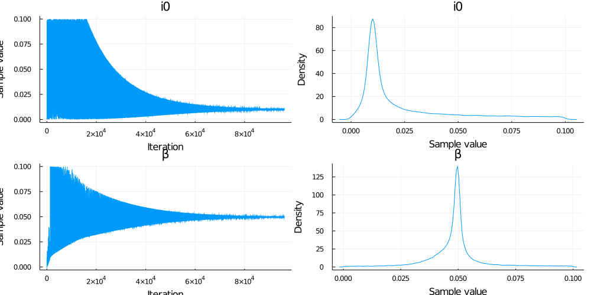

# Ordinary differential equation model with inference using nested sampling
Simon Frost (@sdwfrost) 2020-07-14

## Introduction

The classical ODE version of the SIR model is:

- Deterministic
- Continuous in time
- Continuous in state

In this notebook, we try to infer the parameter values from a simulated dataset using [nested sampling](https://en.wikipedia.org/wiki/Nested_sampling_algorithm), which provides both the posterior distribution of the parameters but also the marginal likelihood (also known as the evidence) of the model, which allows one to perform Bayesian model comparison when models are fitted to the same data.

## Libraries

```julia
using DifferentialEquations
using SimpleDiffEq
using DiffEqSensitivity
using Random
using Distributions
using NestedSamplers
using StatsBase: sample, Weights
using MCMCChains: Chains, describe
using StatsPlots
```


## Transitions

The following function provides the derivatives of the model, which it changes in-place. A variable is included for the cumulative number of infections, $C$, which will be used for inference.

```julia
function sir_ode!(du,u,p,t)
    (S,I,R,C) = u
    (β,c,γ) = p
    N = S+I+R
    infection = β*c*I/N*S
    recovery = γ*I
    @inbounds begin
        du[1] = -infection
        du[2] = infection - recovery
        du[3] = recovery
        du[4] = infection
    end
    nothing
end;
```


## Time domain

We set the timespan for simulations, `tspan`, as well as the times of observations for which we will simulate data, `obstimes`.

```julia
δt = 1.0
tmax = 40.0
tspan = (0.0,tmax)
obstimes = 1.0:1.0:tmax;
```


## Initial conditions

```julia
u0 = [990.0,10.0,0.0,0.0]; # S,I.R,Y
```


## Parameter values

```julia
p = [0.05,10.0,0.25]; # β,c,γ
```


## Running the model

```julia
prob_ode = ODEProblem(sir_ode!,u0,tspan,p)
sol_ode = solve(prob_ode,Tsit5(),saveat=δt);
```


## Generating data

The cumulative counts are extracted.

```julia
out = Array(sol_ode)
C = out[4,:];
```


The new cases per day are calculated from the cumulative counts.

```julia
X = C[2:end] .- C[1:(end-1)];
```


Although the ODE system is deterministic, we can add measurement error to the counts of new cases. Here, a Poisson distribution is used, although a negative binomial could also be used (which would introduce an additional parameter for the variance).

```julia
Random.seed!(1234);
```


```julia
Y = rand.(Poisson.(X));
```


## Inference using nested sampling

The algorithms in `NestedSamplers,jl` require a function that takes the parameters and returns the the log-likelihood. The parameters to be estimated are `i0`, the fraction of the population initially infected, and `\beta`, the infection probability. The contact rate, `c` and the recovery rate, `γ` are set at their true values.

```julia
function ll(x)
    (i0,β) = x
    I = i0*1000.0
    prob = remake(prob_ode,u0=[1000.0-I,I,0.0,0.0],p=[β,10.0,0.25])
    sol = solve(prob,Tsit5(),saveat=δt)
    out = Array(sol)
    C = out[4,:]
    X = C[2:end] .- C[1:(end-1)]
    nonpos = sum(X .<= 0)
    if nonpos > 0
        return Inf
    end
    sum(logpdf.(Poisson.(X),Y))
end;
```


The priors are defined using an array of `Distributions`. For computational expediency for this example, fairly informative priors are used.

```julia
priors = [
    Uniform(0, 0.1),
    Uniform(0, 0.1)
];
```


A `NestedModel` is created from the log likelihood and the priors.

```julia
model = NestedModel(ll, priors);
```


A `Nested` sampler is defined, with 2 parameters and 10000 active points using multi-ellipsoid bounds.

```julia
spl = Nested(2, 10000, bounds=Bounds.MultiEllipsoid);
```


Now we can run the sampler.

```julia
chain = sample(model, spl;
               param_names=["i0", "β"],
               chain_type=Chains);
```


```julia
describe(chain)
```

```
2-element Array{MCMCChains.ChainDataFrame,1}:
 Summary Statistics (2 x 7)
 Quantiles (2 x 6)
```


The plots show nicely how the sampler converges over iterations.

```julia
plot(chain)
```


