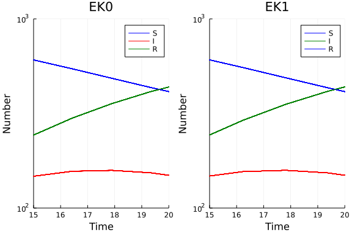
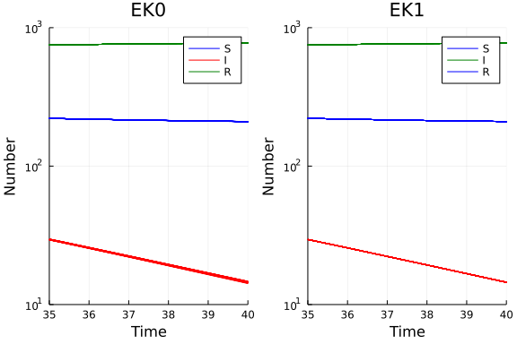

# Ordinary differential equation model with probabilistic integration using ProbNumDiffEq.jl
Simon Frost (@sdwfrost), 2022-02-23

## Introduction

The classical ODE version of the SIR model is:

- Deterministic
- Continuous in time
- Continuous in state

Integration of an ODE is subject to error; one way to capture this error is by probabilistic integration. This tutorial shows how to apply probabilistic integration to an ODE model using solvers from the [ProbNumDiffEq.jl](https://github.com/nathanaelbosch/ProbNumDiffEq.jl) package.

## Libraries

```julia
using ProbNumDiffEq
using Random
using Statistics
using Plots
using BenchmarkTools
```


## Transitions

The following function provides the derivatives of the model, which it changes in-place. State variables and parameters are unpacked from `u` and `p`; this incurs a slight performance hit, but makes the equations much easier to read.

```julia
function sir_ode!(du,u,p,t)
    (S,I,R) = u
    (β,c,γ) = p
    N = S+I+R
    @inbounds begin
        du[1] = -β*c*I/N*S
        du[2] = β*c*I/N*S - γ*I
        du[3] = γ*I
    end
    nothing
end;
```


## Time domain

We set the timespan for simulations, `tspan`, initial conditions, `u0`, and parameter values, `p`.

```julia
δt = 0.1
tmax = 40.0
tspan = (0.0,tmax);
```


## Initial conditions

```julia
u0 = [990.0,10.0,0.0]; # S,I,R
```


## Parameter values

```julia
p = [0.05,10.0,0.25]; # β,c,γ
```


## Random number seed

```julia
Random.seed!(1234);
```


## Running the model

```julia
prob_ode = ODEProblem(sir_ode!,u0,tspan,p);
```


To use probabilistic integration, we just use one of the solvers from ProbNumDiffEq.jl. We'll use the `EK0` and the `EK1` solvers to compare their output. More information on the solvers can be found [here](https://nathanaelbosch.github.io/ProbNumDiffEq.jl/dev/solvers/).

```julia
sol_ode_ek0 = solve(prob_ode,
                EK0(prior=:ibm, order=3, diffusionmodel=DynamicDiffusion(), smooth=true),
                dt=δt,
                abstol=1e-1,
                reltol=1e-2);
```


```julia
sol_ode_ek1 = solve(prob_ode,
                EK1(prior=:ibm, order=3, diffusionmodel=DynamicDiffusion(), smooth=true),
                dt=δt,
                abstol=1e-1,
                reltol=1e-2);
```


## Post-processing

We can look at the mean and standard deviation by examining the `pu` field of the solution. The following gives the mean and standard deviation of `S`, `I`, and `R` at `t=20.0` for the two solvers.

```julia
s20_ek0 = sol_ode_ek0(20.0)
[mean(s20_ek0) std(s20_ek0)]
```

```
3×2 Matrix{Float64}:
 412.269  0.0566167
 149.687  0.0566167
 438.043  0.0566167
```


```julia
s20_ek1 = sol_ode_ek1(20.0)
[mean(s20_ek1) std(s20_ek1)]
```

```
3×2 Matrix{Float64}:
 412.175  0.058913
 149.699  0.0341972
 438.126  0.0740423
```


The standard deviation differs for `S`, `I`, and `R` using the `EK1` solver, but overall, the standard deviations are small.

We can also take samples from the trajectory using `ProbNumDiffEq.sample`.

```julia
num_samples = 100
samples_ode_ek0 = ProbNumDiffEq.sample(sol_ode_ek0, num_samples);
samples_ode_ek1 = ProbNumDiffEq.sample(sol_ode_ek1, num_samples);
```


## Plotting

We can now plot the results; there is a default plotting method (e.g. using `plot(sol_ode_ek1)`), but the below accentuates the differences between samples (although it is low in this case, even on a log scale).

```julia
p_ek0 = plot(sol_ode_ek0.t,
         samples_ode_ek0[:, :, 1],
         label=["S" "I" "R"],
         color=[:blue :red :green],
         xlabel="Time",
         ylabel="Number",
         title="EK0")
for i in 2:num_samples
    plot!(p_ek0,
          sol_ode_ek0.t,
          samples_ode_ek0[:, :, i],
          label="",
          color=[:blue :red :green])
end;
```


```julia
p_ek1 = plot(sol_ode_ek1.t,
         samples_ode_ek1[:, :, 1],
         label=["S" "I" "R"],
         color=[:blue :green],
         xlabel="Time",
         ylabel="Number",
         title="EK1")
for i in 2:num_samples
    plot!(p_ek1,
          sol_ode_ek1.t,
          samples_ode_ek1[:, :, i],
          label="",
          color=[:blue :red :green],)
end;
```


This shows the simulations around the peak.

```julia
plot(p_ek0, p_ek1, layout = (1,2), xlim=(15,20),ylim=(100,1000),yaxis=:log10)
```




This shows the simulations around the end of the timespan.

```julia
plot(p_ek0, p_ek1, layout = (1,2), xlim=(35,40),ylim=(10,1000),yaxis=:log10)
```




## Benchmarking

```julia
@benchmark solve(prob_ode,
                 EK0(prior=:ibm, order=3, diffusionmodel=DynamicDiffusion(), smooth=true),
                 abstol=1e-1,
                 reltol=1e-2)
```

```
BenchmarkTools.Trial: 2595 samples with 1 evaluation.
 Range (min … max):  1.441 ms … 32.918 ms  ┊ GC (min … max): 0.00% … 86.73%
 Time  (median):     1.809 ms              ┊ GC (median):    0.00%
 Time  (mean ± σ):   1.917 ms ±  1.693 ms  ┊ GC (mean ± σ):  4.47% ±  4.83%

               ▁█     █▁                                      
  ▄▇▃▃▃▃▂▄▂▂█▅▂██▃▅▇▃▂██▂▂▂▂▂▂▂▂▂▁▂▁▂▂▁▁▁▁▁▂▁▂▁▁▁▁▂▁▁▁▁▁▁▁▂▂ ▃
  1.44 ms        Histogram: frequency by time        2.92 ms <

 Memory estimate: 482.14 KiB, allocs estimate: 2112.
```


```julia
@benchmark solve(prob_ode,
                 EK1(prior=:ibm, order=3, diffusionmodel=DynamicDiffusion(), smooth=true),
                 abstol=1e-1,
                 reltol=1e-2)
```

```
BenchmarkTools.Trial: 2773 samples with 1 evaluation.
 Range (min … max):  1.338 ms … 32.674 ms  ┊ GC (min … max): 0.00% … 87.11%
 Time  (median):     1.695 ms              ┊ GC (median):    0.00%
 Time  (mean ± σ):   1.793 ms ±  1.490 ms  ┊ GC (mean ± σ):  3.90% ±  4.48%

  ▁▅▂  ▁  ▃ ▁▆▃ ▇▆▁▂▁ ▄█▄                                    ▁
  ████▆██▆███████████▆███▇▆▄▄▃▃▄▆▃▅▃▃▁▃▃▁▁▃▄▁▁▁▁▁▁▁▁▁▃▁▁▁▃▁▃ █
  1.34 ms      Histogram: log(frequency) by time      2.7 ms <

 Memory estimate: 434.48 KiB, allocs estimate: 1921.
```


