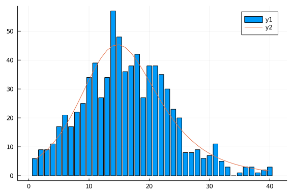
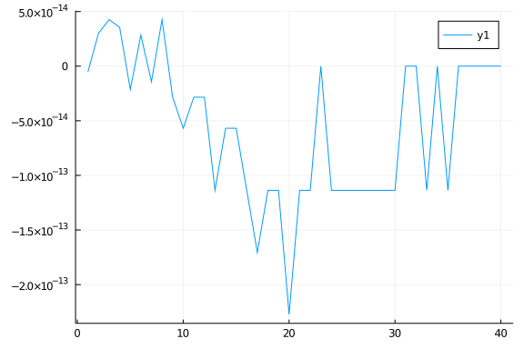
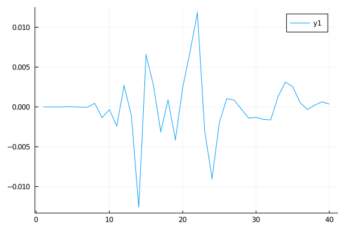
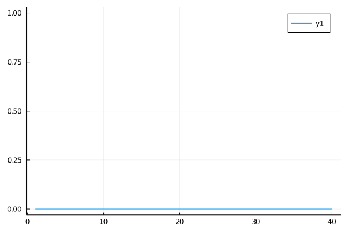

# Generating simulated data using ODE models
Simon Frost (@sdwfrost), 2020-04-27

## Introduction

In this notebook, different ways of generating the number of new cases per day are described.

## Libraries

```julia
using DifferentialEquations
using SimpleDiffEq
using DiffEqCallbacks
using Random
using Distributions
using Plots
```


## Method 1: Calculate cumulative infections and post-process

A variable is included for the cumulative number of infections, $C$.

```julia
function sir_ode!(du,u,p,t)
    (S,I,R,C) = u
    (β,c,γ) = p
    N = S+I+R
    infection = β*c*I/N*S
    recovery = γ*I
    @inbounds begin
        du[1] = -infection
        du[2] = infection - recovery
        du[3] = recovery
        du[4] = infection
    end
    nothing
end;
```


```julia
tmax = 40.0
δt = 1.0
tspan = (0.0,tmax)
obstimes = 1.0:δt:tmax;
u0 = [990.0,10.0,0.0,0.0]; # S,I.R,C
p = [0.05,10.0,0.25]; # β,c,γ
```


```julia
prob_ode = ODEProblem(sir_ode!,u0,tspan,p)
sol_ode_cumulative = solve(prob_ode,Tsit5(),saveat=δt);
```


The cumulative counts are extracted.

```julia
out = Array(sol_ode_cumulative)
C = out[4,:];
```


The new cases per day are calculated from the cumulative counts.

```julia
X = C[2:end] .- C[1:(end-1)];
```


Although the ODE system is deterministic, we can add measurement error to the counts of new cases. Here, a Poisson distribution is used, although a negative binomial could also be used (which would introduce an additional parameter for the variance).

```julia
Random.seed!(1234);
```


```julia
Y = rand.(Poisson.(X));
```


```julia
bar(obstimes,Y)
plot!(obstimes,X)
```




For this particular model, the decline in susceptibles matches the increase in infections. Here is a comparison of the two.

```julia
S = out[1,:]
Cpred = 990.0 .- S
Cdiff = Cpred .- C
plot(obstimes,Cdiff[2:end])
```




Note that the difference between these two curves is at the limit of machine precision.

## Method 2: convert cumulative counts to daily counts using a callback

In order to fit counts of new infections every time unit, we add a callback that sets $C$ to zero at the observation times. This will result in two observations (one with non-zero `C`, one with `C`=0) at each observation time. However, the standard saving behaviour is turned off, so we don't need to have a special saving callback.

```julia
affect!(integrator) = integrator.u[4] = 0.0
cb_zero = PresetTimeCallback(obstimes,affect!);
```


The callback that resets `C` is added to `solve`. Note that this requires `DiffEqCallbacks`. If multiple callbacks are required, then a `CallbackSet` can be passed instead.

```julia
sol_ode_cb = solve(prob_ode,Tsit5(),saveat=δt,callback=cb_zero);
```


We cannot simply convert the solution to an `Array`, as this will give us duplicated timepoints when `C` is reset. Calling the solution with the observation times generates the output before the callback.

```julia
X_cb = sol_ode_cb(obstimes)[4,:];
```


```julia
Random.seed!(1234);
```


```julia
Y_cb = rand.(Poisson.(X_cb));
```


```julia
X_diff_cb = X_cb .- X
plot(obstimes,X_diff_cb)
```



```julia
Y_diff_cb = Y_cb .- Y
plot(obstimes,Y_diff_cb)
```




## Method 3: Use a delay differential equation to track daily counts

```julia
function sir_dde!(du,u,h,p,t)
    (S,I,R,C) = u
    (β,c,γ) = p
    N = S+I+R
    infection = β*c*I/N*S
    recovery = γ*I
    e = oneunit(t)
    history = h(p, t-e)*inv(e)
    @inbounds begin
        du[1] = -infection
        du[2] = infection - recovery
        du[3] = recovery
        du[4] = infection - history[4]
    end
    nothing
end;
```


```julia
function sir_history(p, t; idxs = 5)
    zero(t)
end;
```


```julia
prob_dde = DDEProblem(DDEFunction(sir_dde!),
        u0,
        sir_history,
        tspan,
        p;
        constant_lags = [1.0]);
```


```julia
sol_dde = solve(prob_dde,MethodOfSteps(Tsit5()));
```


```julia
X_dde = sol_dde(obstimes)[4,:];
```


```julia
Random.seed!(1234)
Y_dde = rand.(Poisson.(X_dde));
```


The following plots show that there is a difference both in the underlying model output as well as the simulated (Poisson) data using the delay differential equation.

```julia
X_diff_dde = X_dde .- X
plot(X_diff_dde)
```


```julia
Y_diff_dde = Y_dde .- Y
plot(obstimes, Y_diff_dde)
```


## Summary

While all three methods are mathematically equivalent, the first method, while not directly producing daily counts of cases, results in fewer numerical issues and more easily lends itself to automatic differentiation.

