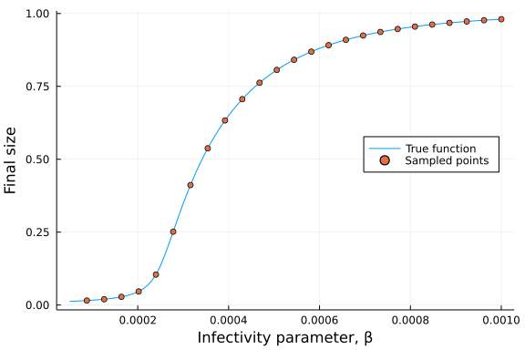
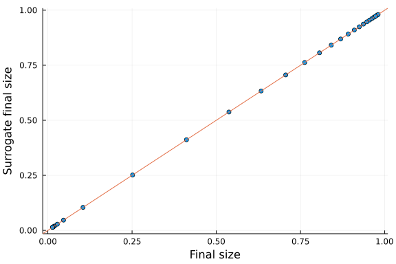
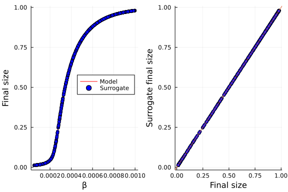
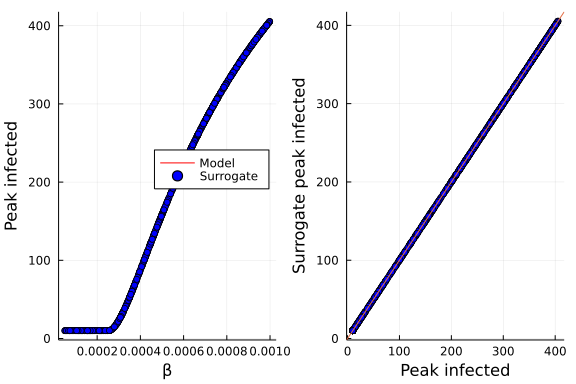

# Surrogate models of an ordinary differential equation model
Simon Frost (@sdwfrost), 2022-03-12

## Introduction

In this notebook, we use `Surrogates.jl` to make a surrogate model or *emulator* of the SIR model (deterministic, using an ODE) with a single input (infectivity). We train surrogate models on three different targets: the final size, the peak number of infected individuals, and the timing of the peak.

## Libraries

```julia
using OrdinaryDiffEq
using DiffEqCallbacks
using Surrogates
using Random
using Optim
using Plots
using BenchmarkTools
```


## Transitions

```julia
function sir_ode!(du,u,p,t)
    (S,I,R) = u
    (β,γ) = p
    @inbounds begin
        du[1] = -β*S*I
        du[2] = β*S*I - γ*I
        du[3] = γ*I
    end
    nothing
end;
```


## Time domain

We set the timespan to be high, as we will be using a callback in order to stop the integration early.

```julia
tmax = 10000.0
tspan = (0.0,tmax);
```


## Callbacks

This callback allows the model to be run until steady state is reached.

```julia
cb_ss = TerminateSteadyState();
```


## Initial conditions

We need to run the model for lots of initial conditions and parameter values.

```julia
n_train = 25 # Number of samples
n_test = 1000; # Number of samples
```


We specify lower (`lb`) and upper (`ub`) bounds for each parameter.

```julia
# Parameters are β
lb = 0.00005
ub = 0.001;
```


## Running the model

```julia
N = 1000.0
u0 = [990.0,10.0,0.0]
p = [0.0005,0.25]
prob_ode = ODEProblem(sir_ode!,u0,tspan,p);
```


## Creating surrogate models

We will create three separate surrogate models, in increasing order of difficulty for the emulators.

### Final size

We start by sampling values of β between the lower and upper bounds using Latin hypercube sampling, which will give more uniform coverage than a uniform sample given the low number of initial points.

```julia
Random.seed!(123)
sampler = LatinHypercubeSample();
```


β will be changed in-place, so we make a copy of the initial sample.

```julia
β = Surrogates.sample(n_train,lb,ub,sampler)
β₀ = copy(β);
```


```julia
final_size = function(β)
  p = prob_ode.p
  p[1] = β
  prob = remake(prob_ode;p=p)
  sol = solve(prob, ROS34PW3(),callback=cb_ss)
  fsp = sol[end][3]/N
  fsp
end;
```


We now compute the final size for our initial sample of β values.

```julia
fs = final_size.(β);
```


This illustrates the initial sampling points.

```julia
β_grid = lb:0.00001:ub
plot(β_grid,final_size.(β_grid),label="True function",xlab="Infectivity parameter, β",ylab="Final size")
scatter!(β,fs,legend=:right,label="Sampled points")
```




We use a `RadialBasis` as a surrogate model for `β`→`fs` between a lower bound, `lb`, and an upper bound, `ub`.

```julia
fs_surrogate = RadialBasis(β, fs, lb, ub, rad=cubicRadial);
```


```julia
scatter(fs,
        fs_surrogate.(β),
        legend=false,
        xlabel="True final size",
        ylabel="Surrogate final size")
Plots.abline!(1.0,0.0)
```


Optimization of this surrogate uses a sequential radial basis function (`SRBF`) approach to search parameter space and generate new samples where needed.

```julia
surrogate_optimize(final_size,
                   SRBF(),
                   lb,
                   ub,
                   fs_surrogate,
                   sampler;
                   maxiters=1000,
                   num_new_samples=1000);
```

```
Exiting, scale too big
```


The above function changes β in-place; the below compares the length of the original number of samples with the optimized surrogate.

```julia
β₁ = copy(β)
length(β₀),length(β)
```

```
(25, 29)
```


The below shows that the surrogate is a good fit, at least for the original plus optimized sampled points.

```julia
fs_opt = final_size.(β)
scatter(fs_opt,fs_surrogate.(β), xlabel="Final size", ylabel="Surrogate final size",legend=false)
Plots.abline!(1.0, 0.0)
```




We now apply our optimized sampler to a finer grid of β in order to assess how well the surrogate model performs for out-of-sample parameter values.

```julia
β_test = sample(n_test,lb,ub,UniformSample())
fs_test = final_size.(β_test)
fs_test_pred = fs_surrogate.(β_test);
```


```julia
l = @layout [a b]
pl1 = plot(β_grid,final_size.(β_grid),color=:red,label="Model",xlabel="β",ylabel="Final size",legend=:right)
scatter!(pl1, β_test,fs_test_pred,color=:blue,label="Surrogate")
pl2 = scatter(fs_test,fs_test_pred,color=:blue,legend=false,xlabel="Final size",ylabel="Surrogate final size")
Plots.abline!(pl2,1.0,0.0)
plot(pl1,pl2,layout=l)
```




Although this is a toy example, where the model runs quickly, the emulator is orders of magnitude faster.

```julia
@benchmark final_size(0.0005)
```

```
BenchmarkTools.Trial: 10000 samples with 1 evaluation.
 Range (min … max):  270.104 μs … 72.356 ms  ┊ GC (min … max): 0.00% … 99.4
6%
 Time  (median):     342.034 μs              ┊ GC (median):    0.00%
 Time  (mean ± σ):   378.619 μs ±  1.232 ms  ┊ GC (mean ± σ):  5.62% ±  1.7
2%

   ▅       ▃█▆▄                                                 
  ██▆▅▃▄▄▄▄█████▇█▇▇▇▇▆▆▅▆▅▅▅▄▄▅▄▄▄▃▃▃▃▃▃▃▂▃▃▂▂▂▂▂▂▂▂▁▁▂▂▂▁▁▁▁ ▃
  270 μs          Histogram: frequency by time          546 μs <

 Memory estimate: 125.98 KiB, allocs estimate: 1357.
```


```julia
@benchmark fs_surrogate(0.0005)
```

```
BenchmarkTools.Trial: 10000 samples with 9 evaluations.
 Range (min … max):  2.841 μs …   7.541 ms  ┊ GC (min … max):  0.00% … 99.9
0%
 Time  (median):     4.121 μs               ┊ GC (median):     0.00%
 Time  (mean ± σ):   6.324 μs ± 103.978 μs  ┊ GC (mean ± σ):  23.23% ±  1.4
1%

   ▁█▆▂                                                        
  ▅█████▇▆▅▅▅▄▃▃▃▂▂▂▂▃▄▆▆▅▄▃▃▄▄▄▃▃▃▂▂▂▂▂▂▂▂▂▂▂▂▂▂▁▁▂▁▁▁▁▁▁▁▁▁ ▂
  2.84 μs         Histogram: frequency by time        10.3 μs <

 Memory estimate: 8.92 KiB, allocs estimate: 96.
```


## Peak infected

To determine the peak number of infected individuals, we make use of the feature where solutions of DiffEq models can be interpolated, and so we can use the solution in a function to maximize `I`, the number of infected individuals (strictly speaking, minimize `-I`).

```julia
peak_infected = function(β)
  p = prob_ode.p
  p[1] = β
  prob = remake(prob_ode;p=p)
  sol = solve(prob, ROS34PW3(),callback=cb_ss)
  tss = sol.t[end]
  f = (t) -> -sol(t,idxs=2)
  opt = Optim.optimize(f,0.0,tss)
  pk = -opt.minimum
  pk
end
```

```
#3 (generic function with 1 method)
```


The peak infected is more difficult to emulate than the final size, due to the discontinuity; when the basic reproductive number, R₀,  is less than 1, the number of infected individuals decreases, and peak infected is I(0) regardless of β.

```julia
plot(β_grid, peak_infected,xlabel="β",ylabel="Peak infected",legend=false)
```


The workflow we used to generate a surrogate for final size is repeated here.

```julia
pk = peak_infected.(β)
pk_surrogate = RadialBasis(β,pk,lb,ub,rad = cubicRadial)
surrogate_optimize(peak_infected,
                   SRBF(),
                   lb,
                   ub,
                   pk_surrogate,
                   sampler;
                   maxiters=1000,
                   num_new_samples=1000)
pk_test = peak_infected.(β_test)
pk_test_pred = pk_surrogate.(β_test);
```

```
Exiting, scale too big
```


```julia
l = @layout [a b]
pl1 = plot(β_grid,peak_infected.(β_grid),color=:red,label="Model",xlabel="β",ylabel="Peak infected",legend=:right)
scatter!(pl1, β_test,pk_test_pred,color=:blue,label="Surrogate")
pl2 = scatter(pk_test,pk_test_pred,color=:blue,legend=false,xlabel="Peak infected",ylabel="Surrogate peak infected")
Plots.abline!(pl2,1.0,0.0)
plot(pl1,pl2,layout=l)
```



```julia
@benchmark peak_infected(0.0005)
```

```
BenchmarkTools.Trial: 10000 samples with 1 evaluation.
 Range (min … max):  271.725 μs … 72.015 ms  ┊ GC (min … max): 0.00% … 99.3
8%
 Time  (median):     346.188 μs              ┊ GC (median):    0.00%
 Time  (mean ± σ):   386.950 μs ±  1.219 ms  ┊ GC (mean ± σ):  5.44% ±  1.7
2%

  ▃▂     █▆▂                                                    
  ██▆▄▄▄▅███▇██▇▇▆▆▅▅▅▅▅▄▄▄▄▄▃▃▃▃▃▃▂▂▂▂▂▂▂▂▂▁▁▁▁▁▁▁▁▁▁▁▁▁▁▁▁▁▁ ▃
  272 μs          Histogram: frequency by time          637 μs <

 Memory estimate: 126.56 KiB, allocs estimate: 1367.
```


```julia
@benchmark pk_surrogate(0.0005)
```

```
BenchmarkTools.Trial: 10000 samples with 8 evaluations.
 Range (min … max):  3.516 μs …   9.187 ms  ┊ GC (min … max):  0.00% … 99.8
8%
 Time  (median):     5.272 μs               ┊ GC (median):     0.00%
 Time  (mean ± σ):   7.848 μs ± 125.410 μs  ┊ GC (mean ± σ):  22.57% ±  1.4
1%

   ▂█▄▃▂                                                       
  ▆██████▇▆▅▅▄▃▃▃▃▃▃▃▄▄▆▇▆▆▅▄▄▄▃▃▃▃▃▂▂▂▂▂▂▂▂▂▂▂▂▂▂▂▂▁▁▁▁▁▁▁▁▁ ▃
  3.52 μs         Histogram: frequency by time        12.8 μs <

 Memory estimate: 11.17 KiB, allocs estimate: 120.
```


## Peak time

Peak time shows strong nonlinearity with β, and so is harder to emulate; we reuse the function for peak infected above, but return the minimizer rather than the minimum value.

```julia
peak_time = function(β)
  p = prob_ode.p
  p[1] = β
  prob = remake(prob_ode;p=p)
  sol = solve(prob, ROS34PW3(),callback=cb_ss)
  tss = sol.t[end]
  f = (t) -> -sol(t,idxs=2)
  opt = Optim.optimize(f,0.0,tss)
  pt = opt.minimizer
  pt
end
```

```
#7 (generic function with 1 method)
```


```julia
plot(β_grid,peak_time,xlabel="β",ylabel="Peak time",legend=false)
```


```julia
pt = peak_time.(β)
pt_surrogate = RadialBasis(β,pt,lb,ub,rad = cubicRadial)
surrogate_optimize(peak_time,
                   SRBF(),
                   lb,
                   ub,
                   pt_surrogate,
                   sampler;
                   maxiters=1000,
                   num_new_samples=1000)
pt_test = peak_time.(β_test)
pt_test_pred = pt_surrogate.(β_test);
```

```
Exiting, scale too big
```


Compared to the other quantities of interest, peak time is not as easily captured by the same (albeit simple) surrogate approach, with deviations at either end of the range.

```julia
l = @layout [a b]
pl1 = plot(β_grid,peak_time.(β_grid),color=:red,label="Model",xlabel="β",ylabel="Peak time",legend=:right)
scatter!(pl1, β_test,pt_test_pred,color=:blue,label="Surrogate")
pl2 = scatter(pt_test,pt_test_pred,color=:blue,legend=false,xlabel="Peak time",ylabel="Surrogate peak time")
Plots.abline!(pl2,1.0,0.0)
plot(pl1,pl2,layout=l)
```


```julia
@benchmark peak_time(0.0005)
```

```
BenchmarkTools.Trial: 10000 samples with 1 evaluation.
 Range (min … max):  271.371 μs … 71.790 ms  ┊ GC (min … max): 0.00% … 99.3
3%
 Time  (median):     343.739 μs              ┊ GC (median):    0.00%
 Time  (mean ± σ):   379.984 μs ±  1.216 ms  ┊ GC (mean ± σ):  5.52% ±  1.7
2%

   █        ▅▃▁                                                 
  ▅█▇▄▄▃▃▃▃▇███▇▅▆▆▆▆▅▅▅▅▄▄▄▄▄▄▄▄▄▄▄▃▃▃▃▃▃▃▂▂▂▂▂▂▂▂▂▂▂▁▁▁▁▁▁▁▁ ▃
  271 μs          Histogram: frequency by time          542 μs <

 Memory estimate: 126.55 KiB, allocs estimate: 1366.
```


```julia
@benchmark pt_surrogate(0.0005)
```

```
BenchmarkTools.Trial: 10000 samples with 6 evaluations.
 Range (min … max):   5.093 μs …  12.951 ms  ┊ GC (min … max):  0.00% … 99.
65%
 Time  (median):      7.974 μs               ┊ GC (median):     0.00%
 Time  (mean ± σ):   12.973 μs ± 201.436 μs  ┊ GC (mean ± σ):  26.76% ±  1.
73%

   ▃█▅▃▁                                                        
  ▇██████▇▆▄▄▃▃▃▃▂▃▄▇▆▅▄▄▄▄▃▃▃▃▃▃▃▃▃▃▃▃▂▃▂▂▂▂▂▂▂▂▂▁▂▁▁▁▁▁▁▁▁▁▁ ▃
  5.09 μs         Histogram: frequency by time         21.8 μs <

 Memory estimate: 16.52 KiB, allocs estimate: 177.
```


## Discussion

With a fairly small number of actual model simulations, the above code generates surrogate models for three separate outputs that work well across the range of parameter inputs and are several orders of magnitude faster than the original model. More complex functional responses e.g. the time to the peak may be harder to capture, and approaches that search new parameter candidates in the local vicinity of existing parameter values may be suboptimal in this case.
