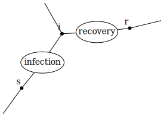
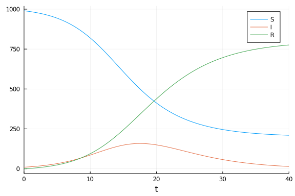

# Petri net model using AlgebraicPetri.jl
Micah Halter (@mehalter), 2021-03-26

## Introduction

One representation of the SIR model is to think of it as the combination of
two interactions, transmission and recovery.
[AlgebraicPetri.jl](https://github.com/AlgebraicJulia/AlgebraicPetri.jl)
allows you to define compositional elements of your models, and then provides
a DSL for defining models as open dynamical systems. This implementation
defines the SIR model as the composition of two interactions defined at
domain-level semantics, transmission and recovery, and then generates an
appropriate ODE solver.

## Libraries

```julia
using AlgebraicPetri
using AlgebraicPetri.Epidemiology

using Catlab
using Catlab.Graphics
using Catlab.WiringDiagrams
using Catlab.CategoricalAlgebra
using Catlab.Programs.RelationalPrograms

using LabelledArrays
using OrdinaryDiffEq
using Random
using Plots

# helper function to visualize categorical representation
display_uwd(ex) = to_graphviz(ex, box_labels=:name, junction_labels=:variable, edge_attrs=Dict(:len=>".75"));
```


## Define the Building Blocks

AlgebraicPetri comes packaged with an `Epidemiology` module with a set of
basic, predefined pieces of epidemiology models. The source starts by
defining a couple helper functions to define two types of interactions: a
spontaneous change in population such as recovery or falling ill after
exposure and an exposure interaction where one population causes a change in
another such as infection. These two helper functions allow us to easily
define the different interactions we find in basic epidemological models such
as infection, exposure, illness, recovery, and death. The resulting objects
are multi-cospan objects where each state in the building block is a leg in the cospan.
This allows us to compose along any of these states individually.

```julia
# population x spontaneously moves to population y
spontaneous_petri(x::Symbol, y::Symbol, transition::Symbol) =
    Open(LabelledPetriNet(unique([x,y]), transition=>(x, y)))
# population y causes population x to move to population z
exposure_petri(x::Symbol, y::Symbol, z::Symbol, transition::Symbol) =
    Open(LabelledPetriNet(unique([x,y,z]), transition=>((x,y)=>(z,y))))

infection = exposure_petri(:S, :I, :I, :inf)
exposure = exposure_petri(:S, :I, :E, :exp)
illness = spontaneous_petri(:E,:I,:ill)
recovery = spontaneous_petri(:I,:R,:rec)
death = spontaneous_petri(:I,:D,:death)
```


Lastly, to integrate with the relational programs syntax provided by
[Catlab.jl](https://github.com/AlgebraicJulia/Catlab.jl) we simply need to
provided a dictionary to connect our new building blocks to labels of their
domain specific semantics.

```julia
epi_dict = Dict(:infection=>infection,
                :exposure=>exposure,
                :illness=>illness,
                :recovery=>recovery,
                :death=>death)

oapply_epi(ex, args...) = oapply(ex, epi_dict, args...)
```


## Transitions

Using the categorical framework provided by the AlgebraicJulia environment,
we can think of building models as defining relations between known building
blocks operating on the system. For example we know that in a simple SIR
model there are two interactions both infection and recovery, and they are
related by sharing a common infected population.

Transmission:

```julia
Graph(infection)
```


Recovery:

```julia
Graph(recovery)
```


With these two building block Petri nets defined, we can use the `@relation`
macro to define an undirected wiring diagram that describes our system.
This step plays the role of describing how we want to compose our building blocks.

```julia
sir_wiring_diagram = @relation (s, i, r) begin
    infection(s, i)
    recovery(i, r)
end
display_uwd(sir_wiring_diagram)
```




using the function `oapply_epi` provided by `AlgebraicPetri.Epidemiology`, we
can convert this categorical definition of SIR to the Petri net
representation and visualize the newly created model.

```julia
sir_model = apex(oapply_epi(sir_wiring_diagram));
Graph(sir_model)
```


## Time domain

```julia
tmax = 40.0
tspan = (0.0,tmax);
```


## Initial conditions

```julia
u0 = LVector(S=990.0, I=10.0, R=0.0)
```

```
3-element LabelledArrays.LArray{Float64, 1, Vector{Float64}, (:S, :I, :R)}:
 :S => 990.0
 :I => 10.0
 :R => 0.0
```


## Parameter values

```julia
p = LVector(inf=0.05*10.0/sum(u0), rec=0.25); # β*c/N,γ
```


## Random number seed

We set a random number seed for reproducibility.

```julia
Random.seed!(1234);
```


## Generating and running models

### As ODEs

```julia
prob_ode = ODEProblem(vectorfield(sir_model),u0,tspan,p)
sol_ode = solve(prob_ode, Tsit5());
plot(sol_ode)
```


