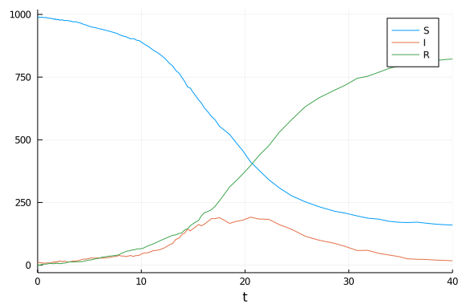
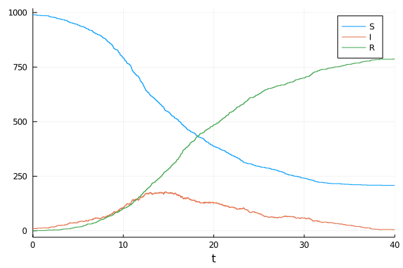

# Petri net model using Petri.jl
Micah Halter (@mehalter), 2020-07-14

## Introduction

This implementation considers the SIR model as a Petri net, using [`Petri.jl`](https://github.com/mehalter/Petri.jl), which is then used to generate ODE, SDE, and jump process models.

## Libraries

```julia
using Petri
using LabelledArrays
using OrdinaryDiffEq
using StochasticDiffEq
using DiffEqJump
using Random
using Plots
```


## Transitions

The Petri model is specified using a vector of the model states (as symbols), and a labelled vector of the transition rates; in this case, `inf` (infection) and `rec` (recovery). Each transition is a tuple of labeled vectors with inputs and outputs.

```julia
sir = Petri.Model([:S,:I,:R],LVector(
                                inf=(LVector(S=1,I=1), LVector(I=2)),
                                rec=(LVector(I=1),     LVector(R=1))))
```

```
Petri.Model{Array{Symbol,1},LabelledArrays.LArray{Tuple{LabelledArrays.LArr
ay{Int64,1,Array{Int64,1},Syms} where Syms,LabelledArrays.LArray{Int64,1,Ar
ray{Int64,1},Syms} where Syms},1,Array{Tuple{LabelledArrays.LArray{Int64,1,
Array{Int64,1},Syms} where Syms,LabelledArrays.LArray{Int64,1,Array{Int64,1
},Syms} where Syms},1},(:inf, :rec)}}([:S, :I, :R], 2-element LabelledArray
s.LArray{Tuple{LabelledArrays.LArray{Int64,1,Array{Int64,1},Syms} where Sym
s,LabelledArrays.LArray{Int64,1,Array{Int64,1},Syms} where Syms},1,Array{Tu
ple{LabelledArrays.LArray{Int64,1,Array{Int64,1},Syms} where Syms,LabelledA
rrays.LArray{Int64,1,Array{Int64,1},Syms} where Syms},1},(:inf, :rec)}:
 :inf => (2-element LabelledArrays.LArray{Int64,1,Array{Int64,1},(:S, :I)}:
 :S => 1
 :I => 1, 1-element LabelledArrays.LArray{Int64,1,Array{Int64,1},(:I,)}:
 :I => 2)
 :rec => (1-element LabelledArrays.LArray{Int64,1,Array{Int64,1},(:I,)}:
 :I => 1, 1-element LabelledArrays.LArray{Int64,1,Array{Int64,1},(:R,)}:
 :R => 1))
```


Using Graphviz, a graph showing the states and transitions can also be generated from the Petri net.

```julia
Graph(sir)
```


## Time domain

```julia
tmax = 40.0
tspan = (0.0,tmax);
```


## Initial conditions

```julia
u0 = LVector(S=990.0, I=10.0, R=0.0)
```

```
3-element LabelledArrays.LArray{Float64,1,Array{Float64,1},(:S, :I, :R)}:
 :S => 990.0
 :I => 10.0
 :R => 0.0
```


## Parameter values

```julia
p = LVector(inf=0.5/sum(u0), rec=0.25);
```


## Random number seed

We set a random number seed for reproducibility.

```julia
Random.seed!(1234);
```


## Generating and running models

### As ODEs

```julia
prob_ode = ODEProblem(sir,u0,tspan,p)
sol_ode = solve(prob_ode, Tsit5());
plot(sol_ode)
```


### As SDEs

```julia
prob_sde,cb = SDEProblem(sir,u0,tspan,p)
sol_sde = solve(prob_sde,LambaEM(),callback=cb);
plot(sol_sde)
```




### As jump process

```julia
prob_jump = JumpProblem(sir, u0, tspan, p)
sol_jump = solve(prob_jump,SSAStepper());
plot(sol_jump)
```


