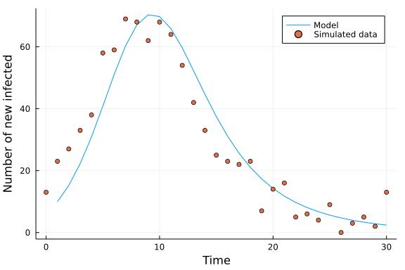
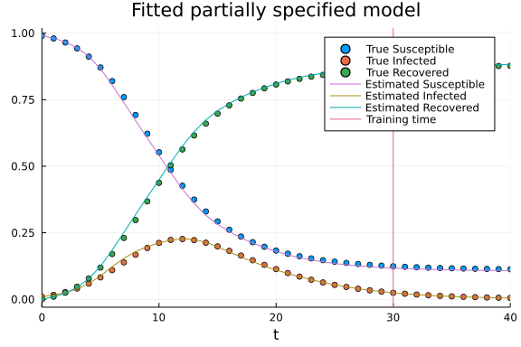

# Partially specified ordinary differential equation model
Simon Frost (@sdwfrost), 2022-04-20

## Introduction

A partially specified model ([Wood 2001](https://doi.org/10.2307/3100042)) is a model where part of the structure is represented by flexible functions. Wood (2001) specifically considers using basis functions to capture terms in an ordinary differential equation. Here, we use such an approach to fit an SIR type model with a modified force of infection to the number of new cases per day i.e. not only is the model partially specified, but the system is partially observed. This example shares much in common with the [universal differential equation (UDE) example](https://github.com/epirecipes/sir-julia/blob/master/markdown/ude/ude.md), except we use a basis function approach rather than a neural network to parameterize the force of infection.

## Libraries

```julia
using OrdinaryDiffEq
using DiffEqCallbacks
using DataInterpolations
using Distributions
using DiffEqFlux, Flux
using Random
using Plots;
```


```julia
Random.seed!(123);
```


## Transitions

[McCallum et al. (2001)](https://doi.org/10.1016/s0169-5347(01)02144-9) consider multiple ways in which transmission can be modelled. Here, we consider a power relationship in which the infection rate scales as the number of infected individuals raised to a power α, where 0<α<1.

```julia
function sira_ode(u,p,t)
    (S,I,C) = u
    (β,γ,α) = p
    dS = -β*S*(I^α)
    dI = β*S*(I^α) - γ*I
    dC = β*S*(I^α)
    [dS,dI,dC]
end;
```


## Settings

```julia
solver = ROS34PW3();
```


We define the total population size, `N`, so we can generate random data of the number of new cases per day. The parameter α results in a tailing off of infection rate as the number of infected individuals increases.

```julia
N = 1000.0
p = [0.5, 0.25, 0.9]
u0 = [0.99, 0.01, 0.0]
tspan = (0., 40.)
δt = 1;
```


## Solving the true model

```julia
sira_prob = ODEProblem(sira_ode, u0, tspan, p)
sira_sol = solve(sira_prob, solver, saveat = δt);
```


We define the time over which the training data are generated, and generate noisy data corresponding to the number of new cases per day.

```julia
train_time = 30.0
tsdata = Array(sira_sol(0:δt:train_time))
cdata = diff(tsdata[3,:])
noisy_data = rand.(Poisson.(N .* cdata));
```


Compared to the 'standard' SIR model (α=1), the modified model has an earlier peak of infected individuals, and the dynamics over time are more skewed.

```julia
tt = 0:δt:train_time
plot(tt[2:end],
     N .* cdata,
     xlabel = "Time",
     ylabel = "Number of new infected",
     label = "Model")
scatter!(tt,
         noisy_data,
         label = "Simulated data")
```




## Partially specified model

We reuse the universal differential equation model.

```julia
function sir_ude(u,p_,t,foi)
    S,I,C = u
    β,γ,α = p
    λ = foi([I],p_)[1]
    dS = -λ*S
    dI = λ*S - γ*I
    dC = λ*S
    [dS, dI, dC]
end;
```


To model the force of infection, we consider an evenly space grid of points of the proportion of infected individuals, using linear interpolation between the points, and an exponential transform to ensure that the force of infection is positive for all parameter values.

```julia
function foi(ivec,p)
    t = 0:0.1:1
    f = LinearInterpolation([0.0;exp.(p)],t)
    return [f(ivec[1])]
end
p_ = log.(0.6 .* collect(0.1:0.1:1));
```


We can now define our partially specified model.

```julia
sir_psm = (u,p_,t) -> sir_ude(u,p_,t,foi)
prob_psm = ODEProblem(sir_psm,
                      u0,
                      (0.0, train_time),
                      p_);
```


Functions for prediction and for the loss function are the same as the UDE example.

```julia
function predict(θ, prob)
    Array(solve(prob,
                solver;
                u0 = u0,
                p = θ,
                saveat = δt,
                sensealg = InterpolatingAdjoint(autojacvec=ReverseDiffVJP())))
end;
```


The use of a `Flux.poisson_loss` term reflects that the data are in the form of counts.

```julia
function loss(θ, prob)
    pred = predict(θ, prob)
    cpred = abs.(N*diff(pred[3,:]))
    Flux.poisson_loss(cpred, float.(noisy_data)), cpred
end;
```


```julia
const losses = []
callback = function (p, l, pred)
    push!(losses, l)
    numloss = length(losses)
    if numloss % 20 == 0
        display("Epoch: " * string(numloss) * " Loss: " * string(l))
    end
    return false
end;
```


We use `sciml_train` to fit the model to the simulated data.

```julia
res_psm = DiffEqFlux.sciml_train((θ)->loss(θ,prob_psm),
                                  p_,
                                  cb = callback);
```

```
"Epoch: 20 Loss: -78.33128076546231"
"Epoch: 40 Loss: -78.35904904828321"
"Epoch: 60 Loss: -78.38656724688342"
"Epoch: 80 Loss: -78.38738000513017"
"Epoch: 100 Loss: -78.38751053385612"
"Epoch: 120 Loss: -78.38754563706708"
"Epoch: 140 Loss: -78.38755736258128"
"Epoch: 160 Loss: -78.38754950316522"
"Epoch: 180 Loss: -78.38755046201794"
"Epoch: 200 Loss: -78.38755039047825"
"Epoch: 220 Loss: -78.38755046719615"
"Epoch: 240 Loss: -78.38755036042015"
"Epoch: 260 Loss: -78.38755039942934"
"Epoch: 280 Loss: -78.38755041969459"
"Epoch: 300 Loss: -78.38755041018656"
"Epoch: 320 Loss: -78.38755036945356"
"Epoch: 340 Loss: -78.38755037167108"
"Epoch: 360 Loss: -78.38755037341743"
```


The fitted model gives a good fit both to the training data (up to time `t=30`), as well as a good forecast until `t=40`.

```julia
prob_psm_fit = ODEProblem(sir_psm, u0, tspan, res_psm.minimizer)
sol_psm_fit = solve(prob_psm_fit, solver, saveat = δt)
scatter(sira_sol, label=["True Susceptible" "True Infected" "True Recovered"],title="Fitted partially specified model")
plot!(sol_psm_fit, label=["Estimated Susceptible" "Estimated Infected" "Estimated Recovered"])
Plots.vline!([train_time],label="Training time")
```




This is the inferred functional relationship between the proportion of infected individuals and the force of infection. Although this does not provide a good fit over the entire domain (`0<I<1`), it does show a downward trend in the slope, at least for low values of `I`.

```julia
Imax = maximum(tsdata[2,:])
Igrid = 0:0.01:1.0 # create a fine grid
β,γ,α = p
λ_true = β .* Igrid.^α
λ = [foi([I], res_psm.minimizer)[1] for I in Igrid]
scatter(Igrid,
        λ,
        xlabel="Proportion of population infected, I",
        ylab="Force of infection, λ",
        label="Model prediction")
Plots.vline!([Imax], color=:orange, label="Upper bound of training data")
plot!(Igrid, λ_true, color=:red, label="True function")
```


## Discussion

The proposal of partially specified models predates that of 'universal differential equations', and in part due to computational considerations at the time, implementations of PSMs use a basis function approach. For the example above, this has a number of advantages, including a smaller number of parameters, resulting in faster and more robust fitting, and easier interpretation.

There are a number of potential improvements to this example. Firstly, there is no penalty term for the 'wiggliness' of the functional response between the proportion of infected individuals and the force of infection. For more complex systems, incorporating such a term may be desirable. Secondly, additional constraints could also be placed on the functional form e.g. ensuring that the force of infection is monotonic.
