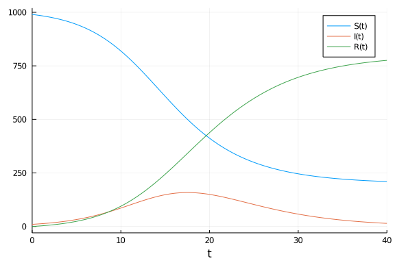
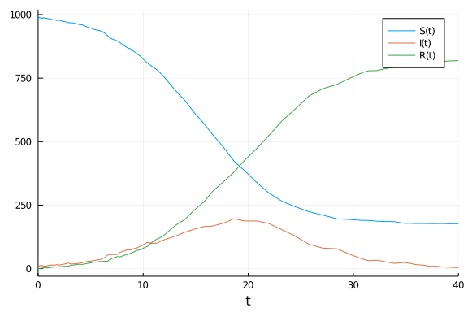
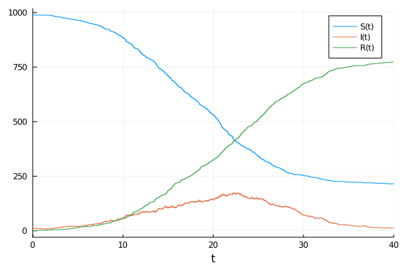

# Reaction network model using ModelingToolkit
Simon Frost (@sdwfrost), 2020-05-20

## Introduction

One high-level representation of the SIR model is as a reaction network, borrowed from systems biology. [ModelingToolkit](https://mtk.sciml.ai/) allows us to convert this representation to ODEs, SDEs, and jump processes. This example is a slightly tweaked version of [one in the ModelingToolkit documentation](https://mtk.sciml.ai/dev/systems/ReactionSystem/), using the population size as a derived variable in the rates for the transitions.

## Libraries

```julia
using DifferentialEquations
using ModelingToolkit
using OrdinaryDiffEq
using StochasticDiffEq
using DiffEqJump
using Random
using Plots
```


## Transitions

```julia
@parameters t β c γ
@variables S(t) I(t) R(t)

N=S+I+R # This is recognized as a derived variable
rxs = [Reaction((β*c)/N, [S,I], [I], [1,1], [2])
       Reaction(γ, [I], [R])]
```

```
2-element Array{ModelingToolkit.Reaction{Any,Int64},1}:
 ModelingToolkit.Reaction{Any,Int64}(c*β*(((I(t)) + (R(t)) + (S(t)))^-1), S
ymbolicUtils.Term{Real}[S(t), I(t)], SymbolicUtils.Term{Real}[I(t)], [1, 1]
, [2], Pair{Any,Int64}[S(t) => -1, I(t) => 1], false)
 ModelingToolkit.Reaction{Any,Int64}(γ, SymbolicUtils.Term{Real}[I(t)], Sym
bolicUtils.Term{Real}[R(t)], [1], [1], Pair{Any,Int64}[I(t) => -1, R(t) => 
1], false)
```


```julia
rs  = ReactionSystem(rxs, t, [S,I,R], [β,c,γ])
```

```
Model ##ReactionSystem#276 with 2 equations
States (3):
  S(t)
  I(t)
  R(t)
Parameters (3):
  β
  c
  γ
```


## Time domain

We set the timespan for simulations, `tspan`, initial conditions, `u0`, and parameter values, `p` (which are unpacked above as `[β,γ]`).

```julia
tmax = 40.0
tspan = (0.0,tmax);
```


## Initial conditions

In `ModelingToolkit`, the initial values are defined by a dictionary.

```julia
u0 = [S => 990.0,
      I => 10.0,
      R => 0.0];
```


## Parameter values

Similarly, the parameter values are defined by a dictionary.

```julia
p = [β=>0.05,
     c=>10.0,
     γ=>0.25];
```


## Random number seed

```julia
Random.seed!(1234);
```


## Generating and running models

### As ODEs

```julia
odesys = convert(ODESystem, rs)
oprob = ODEProblem(odesys, u0, tspan, p)
osol = solve(oprob, Tsit5())
plot(osol)
```




### As SDEs

```julia
sdesys = convert(SDESystem, rs)
sprob = SDEProblem(sdesys, u0, tspan, p)
ssol = solve(sprob, LambaEM())
plot(ssol)
```




### As jump process

To convert to a jump process, we need to set the initial conditions to `Int` rather than `Float`.

```julia
jumpsys = convert(JumpSystem, rs)
u0i = [S => 990, I => 10, R => 0]
dprob = DiscreteProblem(jumpsys, u0i, tspan, p)
jprob = JumpProblem(jumpsys, dprob, Direct())
jsol = solve(jprob, SSAStepper())
plot(jsol)
```


