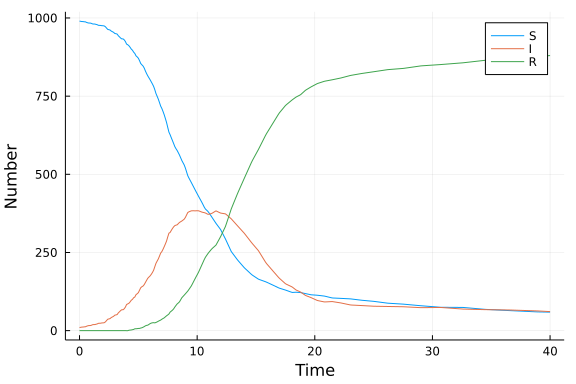

# Stochastic delay differential equation model using StochasticDiffEq.jl
Simon Frost (@sdwfrost), 2021-01-05

## Introduction

A stochastic delay differential equation version of the SIR model is:

- Stochastic
- Continuous in time
- Continuous in state

This implementation uses `StochasticDelayDiffEq.jl`, which has a variety of SDE solvers.

## Libraries

```julia
using DifferentialEquations
using StochasticDelayDiffEq
using DiffEqCallbacks
using Random
using SparseArrays
using Tables
using DataFrames
using StatsPlots
using BenchmarkTools
```


## Transitions

We begin by specifying the DDE kernel, as in the deterministic DDE case.

```julia
function sir_dde!(du,u,h,p,t)
    (S,I,R) = u
    (β,c,τ) = p
    N = S+I+R
    infection = β*c*I/N*S
    (Sd,Id,Rd) = h(p, t-τ) # Time delayed variables
    Nd = Sd+Id+Rd
    recovery = β*c*Id/Nd*Sd
    @inbounds begin
        du[1] = -infection
        du[2] = infection - recovery
        du[3] = recovery
    end
    nothing
end;
```


We define the noise as in the SDE case, but use delayed versions of the state variables to compute the rates.

```julia
# Define a sparse matrix by making a dense matrix and setting some values as not zero
A = zeros(3,2)
A[1,1] = 1
A[2,1] = 1
A[2,2] = 1
A[3,2] = 1
A = SparseArrays.sparse(A);
```


```julia
# Make `g` write the sparse matrix values
function sir_delayed_noise!(du,u,h,p,t)
    (S,I,R) = u
    (β,c,τ) = p
    N = S+I+R
    infection = β*c*I/N*S
    (Sd,Id,Rd) = h(p, t-τ) # Time delayed variables
    Nd = Sd+Id+Rd
    recovery = β*c*Id/Nd*Sd
    du[1,1] = -sqrt(infection)
    du[2,1] = sqrt(infection)
    du[2,2] = -sqrt(recovery)
    du[3,2] = sqrt(recovery)
end;
```


## Callbacks

It is possible for the stochastic jumps to result in negative numbers of infected individuals, which will throw an error. A `ContinuousCallback` is added that resets infected individuals, `I`, to zero if `I` becomes negative.

```julia
function condition(u,t,integrator) # Event when event_f(u,t) == 0
  u[2]
end;
```


```julia
function affect!(integrator)
  integrator.u[2] = 0.0
end;
```


```julia
cb = ContinuousCallback(condition,affect!);
```


## Time domain

```julia
δt = 0.1
tmax = 40.0
tspan = (0.0,tmax)
t = 0.0:δt:tmax;
```


## Initial conditions

```julia
u0 = [990.0,10.0,0.0]; # S,I,R
```


For a delay differential equation (stochastic or deterministic), we need to define a function that determines the past states before the initial time. Here, we assume that all individuals were susceptible at time `t<0`.

```julia
function sir_history(p, t)
    [1000.0, 0.0, 0.0]
end;
```


## Parameter values

We set the recovery interval, τ, to be 1/γ to be consistent with the other examples.

```julia
p = [0.05,10.0,4.0]; # β,c,τ
```


## Random number seed

```julia
Random.seed!(1234);
```


## Running the model

Defining an SDDE is similar to defining an SDE, with the exception of passing an initial condition (the history function) to deal with the lagged states.

```julia
prob_sdde = SDDEProblem(sir_dde!,sir_delayed_noise!,u0,sir_history,tspan,p;noise_rate_prototype=A);
```


The noise process used here is fairly general (non-diagonal and dependent on the states of the system), so the `LambaEM` solver is used.

```julia
sol_sdde = solve(prob_sdde,LambaEM(),callback=cb);
```


## Post-processing

We can convert the output to a dataframe for convenience.

```julia
df_sdde = DataFrame(Tables.table(sol_sdde(t)'))
rename!(df_sdde,["S","I","R"])
df_sdde[!,:t] = t;
```


## Plotting

We can now plot the results.

```julia
@df df_sdde plot(:t,
    [:S,:I,:R],
    label=["S" "I" "R"],
    xlabel="Time",
    ylabel="Number")
```




## Benchmarking

```julia
# @benchmark solve(prob_sdde,LambaEM(),callback=cb)
```

