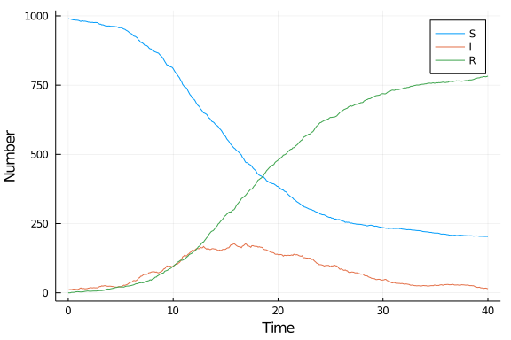

# Stochastic differential equation
Simon Frost (@sdwfrost), 2020-04-27

## Introduction

A stochastic differential equation version of the SIR model is:

- Stochastic
- Continuous in time
- Continuous in state

## Libraries

```julia
using DifferentialEquations
using SimpleDiffEq
using Distributions
using Random
using DataFrames
using StatsPlots
using BenchmarkTools
```


## Transitions

```julia
function sir_sde!(du,u,p,t)
    (S,I,R) = u
    (β,c,γ,δt) = p
    N = S+I+R
    ifrac = β*c*I/N*S*δt
    rfrac = γ*I*δt
    ifrac_noise = sqrt(ifrac)*rand(Normal(0,1))
    rfrac_noise = sqrt(rfrac)*rand(Normal(0,1))
    @inbounds begin
        du[1] = S-(ifrac+ifrac_noise)
        du[2] = I+(ifrac+ifrac_noise) - (rfrac + rfrac_noise)
        du[3] = R+(rfrac+rfrac_noise)
    end
    for i in 1:3
        if du[i] < 0 du[i]=0 end
    end
    nothing
end;
```


## Time domain

Note that even though we're using fixed time steps, `DifferentialEquations.jl` complains if I pass integer timespans, so I set the timespan to be `Float64`.

```julia
δt = 0.1
nsteps = 400
tmax = nsteps*δt
tspan = (0.0,nsteps)
t = 0.0:δt:tmax;
```


## Initial conditions

```julia
u0 = [990.0,10.0,0.0]; # S,I,R
```


## Parameter values

```julia
p = [0.05,10.0,0.25,δt]; # β,c,γ,δt
```


## Random number seed

```julia
Random.seed!(1234);
```


## Running the model

```julia
prob_sde = DiscreteProblem(sir_sde!,u0,tspan,p)
```

```
DiscreteProblem with uType Array{Float64,1} and tType Float64. In-place: tr
ue
timespan: (0.0, 400.0)
u0: [990.0, 10.0, 0.0]
```


```julia
sol_sde = solve(prob_sde,solver=FunctionMap);
```


## Post-processing

We can convert the output to a dataframe for convenience.

```julia
df_sde = DataFrame(sol_sde')
df_sde[!,:t] = t;
```


## Plotting

We can now plot the results.

```julia
@df df_sde plot(:t,
    [:x1 :x2 :x3],
    label=["S" "I" "R"],
    xlabel="Time",
    ylabel="Number")
```




## Benchmarking

```julia
@benchmark solve(prob_sde,solver=FunctionMap)
```

```
BenchmarkTools.Trial: 
  memory estimate:  57.52 KiB
  allocs estimate:  446
  --------------
  minimum time:     49.741 μs (0.00% GC)
  median time:      61.782 μs (0.00% GC)
  mean time:        73.177 μs (6.27% GC)
  maximum time:     9.847 ms (98.83% GC)
  --------------
  samples:          10000
  evals/sample:     1
```


