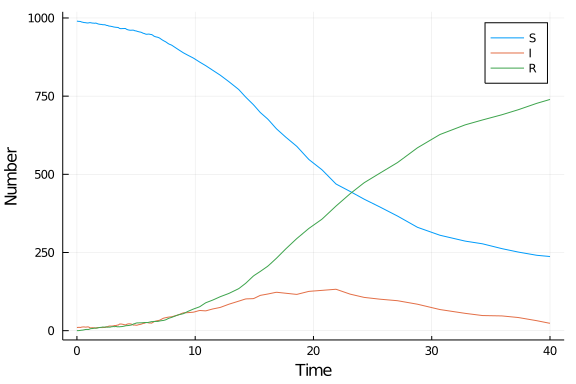

# Stochastic differential equation model using StochasticDiffEq.jl
Simon Frost (@sdwfrost), 2020-04-27

## Introduction

A stochastic differential equation version of the SIR model is:

- Stochastic
- Continuous in time
- Continuous in state

This implementation uses `StochasticDiffEq.jl`, which has a variety of SDE solvers.

## Libraries

```julia
using DifferentialEquations
using StochasticDiffEq
using DiffEqCallbacks
using Random
using SparseArrays
using DataFrames
using StatsPlots
using BenchmarkTools
```


## Transitions

We begin by specifying the ODE kernel.

```julia
function sir_ode!(du,u,p,t)
    (S,I,R) = u
    (β,c,γ) = p
    N = S+I+R
    @inbounds begin
        du[1] = -β*c*I/N*S
        du[2] = β*c*I/N*S - γ*I
        du[3] = γ*I
    end
    nothing
end;
```


```julia
# Define a sparse matrix by making a dense matrix and setting some values as not zero
A = zeros(3,2)
A[1,1] = 1
A[2,1] = 1
A[2,2] = 1
A[3,2] = 1
A = SparseArrays.sparse(A);
```


```julia
# Make `g` write the sparse matrix values
function sir_noise!(du,u,p,t)
    (S,I,R) = u
    (β,c,γ) = p
    N = S+I+R
    ifrac = β*c*I/N*S
    rfrac = γ*I
    du[1,1] = -sqrt(ifrac)
    du[2,1] = sqrt(ifrac)
    du[2,2] = -sqrt(rfrac)
    du[3,2] = sqrt(rfrac)
end;
```


## Callbacks

It is possible for the stochastic jumps to result in negative numbers of infected individuals, which will throw an error. A `ContinuousCallback` is added that resets infected individuals, `I`, to zero if `I` becomes negative.

```julia
function condition(u,t,integrator) # Event when event_f(u,t) == 0
  u[2]
end;
```


```julia
function affect!(integrator)
  integrator.u[2] = 0.0
end;
```


```julia
cb = ContinuousCallback(condition,affect!);
```


## Time domain

```julia
δt = 0.1
tmax = 40.0
tspan = (0.0,tmax)
t = 0.0:δt:tmax;
```


## Initial conditions

```julia
u0 = [990.0,10.0,0.0]; # S,I,R
```


## Parameter values

```julia
p = [0.05,10.0,0.25]; # β,c,γ
```


## Random number seed

```julia
Random.seed!(1234);
```


## Running the model

```julia
prob_sde = SDEProblem(sir_ode!,sir_noise!,u0,tspan,p,noise_rate_prototype=A);
```


The noise process used here is fairly general (non-diagonal and dependent on the states of the system), so the `LambaEM` solver is used.

```julia
sol_sde = solve(prob_sde,LambaEM(),callback=cb);
```


## Post-processing

We can convert the output to a dataframe for convenience.

```julia
df_sde = DataFrame(sol_sde(t)')
df_sde[!,:t] = t;
```


## Plotting

We can now plot the results.

```julia
@df df_sde plot(:t,
    [:x1 :x2 :x3],
    label=["S" "I" "R"],
    xlabel="Time",
    ylabel="Number")
```




## Benchmarking

```julia
@benchmark solve(prob_sde,LambaEM(),callback=cb)
```

```
BenchmarkTools.Trial: 
  memory estimate:  161.75 KiB
  allocs estimate:  2095
  --------------
  minimum time:     292.298 μs (0.00% GC)
  median time:      514.139 μs (0.00% GC)
  mean time:        598.129 μs (7.33% GC)
  maximum time:     25.207 ms (94.77% GC)
  --------------
  samples:          8341
  evals/sample:     1
```


dix()
```
